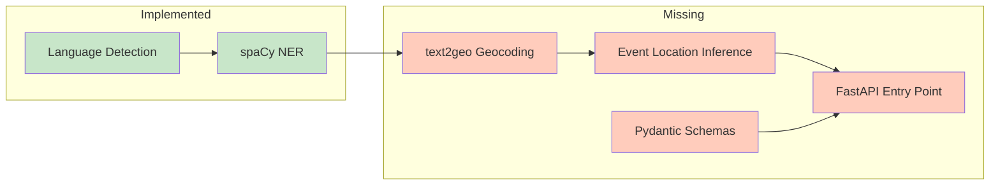

# Location Extraction Service — Context

> Status snapshot as of 2026-05-12. Generated from source inspection.

## Purpose

High-throughput, low-latency NLP service that extracts geographic locations from unstructured text (news articles). Designed for 1000+ articles/day with sub-second latency, global coverage, and zero API costs.

## Pipeline Architecture (Target)

```
Input Text → Language Detection → spaCy NER → text2geo Geocoder → Event Location Inference → JSON
```

## Implementation Status

### Source Files

| Component | File | Status | Lines | Notes |
|-----------|------|--------|-------|-------|
| Language Detection | `src/pipeline/detector.py` | ✅ Done | 30 | langdetect, EN/FR, fallback to "en" |
| NER — Model Manager | `src/pipeline/nlp_manager.py` | ✅ Done | 36 | spaCy LRU cache (maxsize=2), EN/FR |
| NER — Entity Extraction | `src/pipeline/extractor.py` | ✅ Done | 32 | GPE/LOC extraction |
| Geocoding | `src/geocoding/geocoder.py` | ❌ Missing | — | text2geo wrapper not implemented; `src/geocoding/` has no `__init__.py` |
| Event Location Inference | `src/pipeline/disambiguator.py` | ❌ Missing | — | Scoring/location disambiguation not implemented |
| Pydantic Schemas | `src/models/schemas.py` | ❌ Missing | — | Request/response models not implemented |
| FastAPI Entry Point | `src/__main__.py` | ❌ Missing | — | App, routes, startup, health check not implemented |
| Package inits | `src/__init__.py`, `src/pipeline/__init__.py`, `src/models/__init__.py` | ⚠️ Stub | 0 | Empty files, need proper `__init__` exports |

### Current State Diagram



### Test Files

| Test File | Status | Details |
|-----------|--------|---------|
| `tests/unit/test_detector.py` | ✅ Done | 8 tests, covers EN/FR detection, empty input, exception fallback |
| `tests/integration/test_nlp_manager.py` | ✅ Done | 5 tests, covers model loading, caching, fallback, concurrency |
| `tests/unit/test_extractor.py` | ⚠️ Partial | 2 tests — only empty/whitespace input checked |
| `tests/unit/test_disambiguator.py` | ⚠️ Stubs | 9 test functions, all `pass` |
| `tests/integration/test_pipeline_integration.py` | ⚠️ Stubs | 14 functional + 2 perf tests, all `pass` |
| `tests/test_geocoder.py` | ❌ Missing | Not created (listed in AGENTS.md but absent) |
| `tests/conftest.py` | ✅ Done | Shared fixtures (sample EN/FR/mixed texts) |
| `tests/integration/conftest.py` | ✅ Done | Session-scoped spaCy model env setup |

### Infrastructure

| Item | Status | Notes |
|------|--------|-------|
| `pyproject.toml` | ✅ Done | Dependencies, ruff config, pytest settings |
| `Dockerfile` | ✅ Done | Python 3.14-slim, uv, spaCy models, text2geo data |
| `docker-compose.yml` | ✅ Done | Port 8000, health check, env vars |
| `.env.example` | ✅ Done | HOST, PORT, LOG_LEVEL |
| `.gitignore` | ✅ Done | Python/IDE/OS ignores |
| `uv.lock` | ✅ Done | Deterministic dependency lock |

### Documentation

| Doc | Status | Notes |
|-----|--------|-------|
| `README.md` | ⚠️ Outdated | Describes API that doesn't exist yet, references nonexistent `src:app` |
| `AGENTS.md` | ⚠️ Outdated | Good reference but lists nonexistent files (disambiguator, geocoder, schemas, `__main__`, geocoder test) |
| `design/architecture/location-extraction.md` | ✅ Complete | Comprehensive design doc; MVP checklist all unchecked |
| `design/decisions/ADR-001-location-extraction-approach.md` | ✅ Complete | ADR for spaCy+text2geo, upgrade paths |
| `design/architecture/overview.md` | ✅ Complete | System-wide architecture |

### Dependency Versions

| Package | Version | Purpose |
|---------|---------|---------|
| fastapi | >=0.135.0 | API server |
| uvicorn | >=0.30.0 | ASGI server |
| pydantic | >=2.9.0 | Data validation |
| spacy | >=3.8.0 | NLP framework |
| langdetect | >=1.0.9 | Language detection |
| text2geo | git (`charonviz/text2geo`) | Offline geocoding |
| python-dotenv | >=1.0.0 | Env var loading |
| pytest (dev) | >=9.0.0 | Testing |
| pytest-asyncio (dev) | >=0.24.0 | Async test support |
| pytest-cov (dev) | >=6.0.0 | Coverage reports |
| httpx (dev) | >=0.28.0 | HTTP test client |
| ruff (dev) | >=0.9.0 | Linting/formatting |

### Performance Targets (from ADR)

| Metric | Target |
|--------|--------|
| Latency (p95) | <1 second per document |
| Throughput | 1000+ articles/day |
| Memory | ~2GB (spaCy models + geocoder) |
| Location extraction rate | >90% of articles |
| Location accuracy | >85% for clear mentions |

## Known Gaps

1. **No geocoding** — text2geo wrapper missing; pipeline stops after NER
2. **No disambiguation** — event location inference missing
3. **No API server** — FastAPI app, routes, health check not implemented
4. **No request/response models** — Pydantic schemas missing
5. **No `[project.scripts]` entry point** in pyproject.toml
6. **Tests mostly stubs** — only detector and nlp_manager have real tests
7. **Extractor test coverage sparse** — only checks empty input
8. **Docs out of sync** — README and AGENTS.md reference nonexistent code

## Recommended Build Order

1. `src/models/schemas.py` — Pydantic models (foundation for everything)
2. `src/geocoding/__init__.py` + `src/geocoding/geocoder.py` — text2geo wrapper (pipeline Stage 3)
3. `src/pipeline/disambiguator.py` — Event location inference (pipeline Stage 4)
4. `src/__main__.py` — FastAPI app (wires pipeline + schemas into runnable server)
5. Fill in test stubs — `test_extractor.py`, `test_geocoder.py`, `test_disambiguator.py`, `test_pipeline_integration.py`
6. Sync docs — Update README.md and AGENTS.md to match actual code
