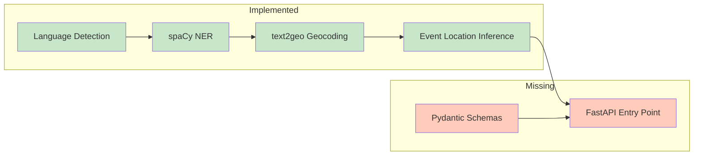

# Location Extraction Service — Context

> Status snapshot as of 2026-05-14. Generated from source inspection.

## Purpose

High-throughput, low-latency NLP service that extracts geographic locations from unstructured text (news articles). Designed for 1000+ articles/day with sub-second latency, global coverage, and zero API costs.

## Pipeline Architecture (Target)

```
Input Text → Language Detection → spaCy NER → text2geo Geocoder → Event Location Inference → JSON
```

## Implementation Status

### Source Files

| Component                  | File                         | Status     | Lines | Notes                                                                                      |
| -------------------------- | ---------------------------- | ---------- | ----- | ------------------------------------------------------------------------------------------ |
| Pipeline (consolidated)    | `src/pipeline.py`            | ✅ Done    | 88    | Single module: `NerPipeline` + `NerResult` + internal detection/NER/model caching          |
| Evaluation — Pure Compute  | `src/evaluation/__init__.py` | ✅ Done    | 34    | `evaluate()` (precision, recall, harmonic mean (F1)), no I/O or pipeline imports           |
| Evaluation — Orchestration | `src/evaluation/runner.py`   | ✅ Done    | 114   | `evaluate_corpus()`, `evaluate_all_corpora()`, `discover_corpora()`, `load_corpus()`       |
| Evaluation — CLI           | `src/evaluation/__main__.py` | ✅ Done    | 115   | CLI entry point, imports from `runner.py`                                                  |
| Geocoding                  | `src/geocoding.py`           | ✅ Done    | 48    | `GeoPipeline` + `GeoResult` + internal geonamescache wrapper, mocked tests                 |
| Event Location Inference   | `src/disambiguator.py`       | ✅ Done    | 83    | `DisambiguatePipeline` + `DisambiguateResult` + position/type/preposition scoring          |
| Pydantic Schemas           | future                       | ❌ Missing | —     | Request/response models                                                                    |
| FastAPI Entry Point        | future                       | ❌ Missing | —     | App, routes, startup, health check                                                         |

### Current State Diagram



### Test Files

| Test File                                        | Status     | Details                                                                                                                  |
| ------------------------------------------------ | ---------- | ------------------------------------------------------------------------------------------------------------------------ |
| `tests/unit/test_detector.py`                    | ✅ Done    | 8 tests, covers EN/FR detection, empty input, exception fallback                                                         |
| `tests/integration/test_nlp_manager.py`          | ✅ Done    | 5 tests, covers model loading, caching, fallback, concurrency                                                            |
| `tests/unit/test_extractor.py`                   | ⚠️ Partial | 2 tests — only empty/whitespace input checked                                                                            |
| `tests/unit/test_disambiguator.py`               | ✅ Done    | 9 tests, covers position/type scoring, empty input, confidence, ungeocoded skip, country_name, preposition boosting      |
| `tests/integration/test_pipeline_integration.py` | ⚠️ Stubs   | 14 functional + 2 perf tests, all `pass`                                                                                 |
| `tests/unit/test_geocoding.py`                   | ✅ Done    | 8 tests, covers single/multiple/partial/none/empty geocoding, original text preserved, no name/type in output            |
| `tests/unit/test_evaluation.py`                  | ✅ Done    | 22 tests, covers `evaluate()`, `evaluate_corpus()`, `load_corpus()`, `discover_corpora()`, `evaluate_all_corpora()`, CLI |
| `tests/conftest.py`                              | ✅ Done    | Shared fixtures (sample EN/FR/mixed texts)                                                                               |
| `tests/integration/conftest.py`                  | ✅ Done    | Session-scoped spaCy model env setup                                                                                     |

### Infrastructure

| Item                 | Status  | Notes                                             |
| -------------------- | ------- | ------------------------------------------------- |
| `pyproject.toml`     | ✅ Done | Dependencies, ruff config, pytest settings        |
| `Dockerfile`         | ✅ Done | Python 3.14-slim, uv, spaCy models, text2geo data |
| `docker-compose.yml` | ✅ Done | Port 8000, health check, env vars                 |
| `.env.example`       | ✅ Done | HOST, PORT, LOG_LEVEL                             |
| `.gitignore`         | ✅ Done | Python/IDE/OS ignores                             |
| `uv.lock`            | ✅ Done | Deterministic dependency lock                     |

### Documentation

| Doc                                                        | Status      | Notes                                                                  |
| ---------------------------------------------------------- | ----------- | ---------------------------------------------------------------------- |
| `README.md`                                                | ⚠️ Outdated | Describes API that doesn't exist yet, references nonexistent `src:app` |
| `AGENTS.md`                                                | ✅ Updated  | File structure and component table reflect NerPipeline + runner.py     |
| `design/architecture/location-extraction.md`               | ✅ Updated  | File structure section reflects new module layout                      |
| `design/decisions/ADR-001-location-extraction-approach.md` | ✅ Complete | ADR for spaCy+text2geo, upgrade paths                                  |
| `design/decisions/ADR-002-ner-evaluation-protocol.md`      | ✅ Complete | ADR for NER evaluation protocol                                        |
| `design/decisions/ADR-003-ner-pipeline-seam.md`            | ✅ Accepted | ADR for NerPipeline seam + evaluation restructuring                    |
| `design/architecture/overview.md`                          | ✅ Complete | System-wide architecture                                               |

### Dependency Versions

| Package              | Version                    | Purpose                 |
| -------------------- | -------------------------- | ----------------------- |
| fastapi              | >=0.135.0                  | API server              |
| uvicorn              | >=0.30.0                   | ASGI server             |
| pydantic             | >=2.9.0                    | Data validation         |
| spacy                | >=3.8.0                    | NLP framework           |
| langdetect           | >=1.0.9                    | Language detection      |
| geonamescache        | >=3.0.1                    | Offline geocoding       |
| pycountry            | >=26.2.16                  | ISO country name lookup |
| python-dotenv        | >=1.0.0                    | Env var loading         |
| pytest (dev)         | >=9.0.0                    | Testing                 |
| pytest-asyncio (dev) | >=0.24.0                   | Async test support      |
| pytest-cov (dev)     | >=6.0.0                    | Coverage reports        |
| httpx (dev)          | >=0.28.0                   | HTTP test client        |
| ruff (dev)           | >=0.9.0                    | Linting/formatting      |

### Performance Targets (from ADR)

| Metric                   | Target                         |
| ------------------------ | ------------------------------ |
| Latency (p95)            | <1 second per document         |
| Throughput               | 1000+ articles/day             |
| Memory                   | ~2GB (spaCy models + geocoder) |
| Location extraction rate | >90% of articles               |
| Location accuracy        | >85% for clear mentions        |

## Known Gaps

1. **No API server** — FastAPI app, routes, health check not implemented
2. **No request/response models** — Pydantic schemas missing
3. **No `[project.scripts]` entry point** in pyproject.toml
4. **Extractor test coverage sparse** — only checks empty input
5. **Pipeline integration tests are stubs** — all `pass` only

## Recommended Build Order

1. `src/models/schemas.py` — Pydantic models (foundation for everything)
2. ✅ `src/geocoding.py` — text2geo wrapper as `GeoPipeline` (pipeline Stage 3) — **DONE**
3. ✅ `src/disambiguator.py` — Event location inference (pipeline Stage 4) — **DONE**
4. `src/__main__.py` — FastAPI app (wires pipeline + schemas into runnable server)
5. Fill in test stubs — `test_extractor.py`, `test_pipeline_integration.py`
