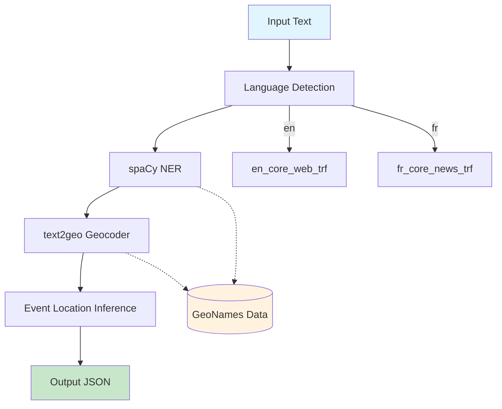
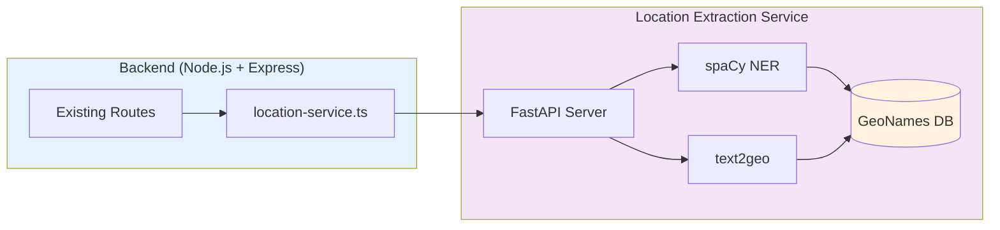

# Location Extraction Service - Architecture

## Overview

A high-throughput, low-latency NLP service that extracts geographic locations from unstructured text (news articles). Designed for processing 1000+ articles/day with sub-second latency, global coverage, and zero API costs.

## Goals

- Extract location mentions from article text
- Disambiguate place names to correct geographic coordinates
- Return structured location data (lat/lon, name, country)
- Process 1000+ articles/day with <1s latency per article
- Global geographic coverage via GeoNames
- Zero external API costs (fully offline)
- Multilingual support (English, French for MVP)
- Deterministic behavior (controlled via seed for reproducible results)

## Pipeline Architecture



### Stage 1: Language Detection

**Technology**: `langdetect`

**Function**: Detect article language to select appropriate NER model

```python
import langdetect
from langdetect import DetectorFactory, LangDetectException

# Seed ensures deterministic results - required for production
DetectorFactory.seed = 0


def detect_language(text: str) -> str:
    if not text or not text.strip():
        return "en"

    try:
        langs = langdetect.detect_langs(text)
        return langs[0].lang if langs else "en"
    except (LangDetectException, Exception):
        return "en"  # Default fallback
```

**Supported Languages (MVP)**:

- `en` - English
- `fr` - French

**Future**: Easy to extend with additional language models.

### Stage 2: Named Entity Recognition (NER)

**Technology**: spaCy with transformer-based models

**Function**: Identify location mentions (GPE, LOC entities) in text

**Models (MVP)**:

| Language | Model              | Size   | Accuracy |
| -------- | ------------------ | ------ | -------- |
| English  | `en_core_web_trf`  | ~500MB | Best     |
| French   | `fr_core_news_trf` | ~500MB | Best     |

```python
import spacy
from functools import lru_cache

_models = {}

@lru_cache(maxsize=2)
def get_ner_model(lang: str) -> spacy.Language:
    model_map = {
        "en": "en_core_web_trf",
        "fr": "fr_core_news_trf"
    }
    model_name = model_map.get(lang, "en_core_web_trf")
    return spacy.load(model_name)

def extract_location_mentions(text: str, lang: str) -> list[dict]:
    nlp = get_ner_model(lang)
    doc = nlp(text)
    locations = []
    for ent in doc.ents:
        if ent.label_ in ("GPE", "LOC"):
            locations.append({
                "text": ent.text,
                "label": ent.label_,
                "start": ent.start_char,
                "end": ent.end_char
            })
    return locations
```

**Entity Types**:

- `GPE`: Geopolitical entities (countries, cities, states)
- `LOC`: Non-GPE locations (mountains, seas, regions)

### Stage 3: Toponym Resolution (Geocoding)

**Technology**: `text2geo`

**Function**: Convert place names to coordinates using GeoNames data

**Features**:

- Offline operation (no API calls)
- 140,000+ cities worldwide
- Fuzzy matching for misspellings
- Multi-language place name support

```python
from text2geo import Geocoder

geo = Geocoder(dataset="world")

def geocode_locations(mentions: list[dict]) -> list[dict]:
    results = []
    for mention in mentions:
        result = geo.geocode(mention["text"])
        if result:
            results.append({
                "text": mention["text"],
                "lat": result["lat"],
                "lon": result["lon"],
                "name": result["name"],
                "country": result["country"]
            })
    return results
```

### Stage 4: Event Location Inference

**Function**: Identify the primary event location from multiple extracted locations

**Approach**: Weighted scoring based on:

1. **Position** - Earlier mentions are more likely primary location
2. **Type** - GPE entities score higher than LOC
3. **Context** - Prepositions ("in", "at", "near") indicate event location

```python
def infer_event_location(locations: list[dict], text: str) -> dict | None:
    if not locations:
        return None

    scored_locations = []
    for i, loc in enumerate(locations):
        position_score = 1.0 / (i + 1)  # Earlier = higher score
        type_score = 1.5 if loc.get("label") == "GPE" else 1.0

        scored_locations.append({
            **loc,
            "final_score": position_score * type_score
        })

    best = max(scored_locations, key=lambda x: x["final_score"])
    return {
        "text": best["text"],
        "lat": best.get("lat"),
        "lon": best.get("lon"),
        "country": best.get("country"),
        "confidence": min(best["final_score"] * 0.5, 1.0)
    }
```

## Output Format

```json
{
  "detected_language": "fr",
  "event_location": {
    "text": "Paris",
    "lat": 48.8566,
    "lon": 2.3522,
    "country": "FR",
    "country_name": "France",
    "confidence": 0.85
  },
  "all_locations": [
    {
      "text": "Paris",
      "lat": 48.8566,
      "lon": 2.3522,
      "name": "Paris",
      "country": "FR",
      "type": "GPE"
    },
    {
      "text": "Seine",
      "lat": 49.0,
      "lon": 2.5,
      "name": "Seine",
      "type": "LOC"
    }
  ],
  "metadata": {
    "processing_time_ms": 150,
    "language_model": "fr_core_news_trf",
    "entities_found": 2,
    "entities_geocoded": 2
  }
}
```

## Service Architecture



### API Endpoint

```
POST /api/extract-location
Content-Type: application/json

{
  "text": "Article text content here...",
  "language": "auto"  // "auto" for detection, or "en"/"fr" for specific
}

Response: Location extraction result (see Output Format)
```

### Performance Targets

| Metric        | Target         | Notes                               |
| ------------- | -------------- | ----------------------------------- |
| Throughput    | 1000+ docs/day | ~12 docs/minute sustained           |
| Latency (p95) | <1 second      | Per document                        |
| Memory        | ~2GB           | spaCy models + geocoder             |
| Accuracy      | >85%           | Correct location for clear mentions |

## Technology Stack

| Component          | Technology          | Version | Rationale                              |
| ------------------ | ------------------- | ------- | -------------------------------------- |
| NER                | spaCy               | 3.x     | Industry standard, transformer support |
| NER Models         | en/fr_core_news_trf | latest  | Best accuracy for EN/FR                |
| Language Detection | langdetect          | latest  | Lightweight, no training needed (seed=0 for determinism) |
| Geocoder           | text2geo            | latest  | Offline, fast, GeoNames-based          |
| Runtime            | Python 3.14         | latest  | Latest Python with best performance    |
| API Server         | FastAPI             | latest  | Fast, async, auto-docs                 |
| Container          | Docker              | -       | Isolated, reproducible                 |

## File Structure

```
backend/
├── src/
│   ├── routes/
│   │   └── location-extraction.ts   # API endpoint
│   ├── services/
│   │   └── location-service.ts      # HTTP client for Python service
│   └── ...
├── location-extraction-service/     # Python microservice
│   ├── src/
│   │   ├── __main__.py              # FastAPI application
│   │   ├── pipeline/
│   │   │   ├── detector.py           # Language detection
│   │   │   ├── nlp_manager.py        # spaCy model manager
│   │   │   ├── extractor.py          # NER logic
│   │   │   └── disambiguator.py      # Event location inference
│   │   └── geocoding/
│   │       └── geocoder.py          # text2geo wrapper
│   ├── models/
│   │   └── multilingual/             # Downloaded spaCy models
│   ├── Dockerfile
│   ├── requirements.txt
│   └── README.md
└── ...
```

## Dockerfile

```dockerfile
FROM python:3.11-slim

WORKDIR /app

RUN apt-get update && apt-get install -y --no-install-recommends \
    build-essential \
    && rm -rf /var/lib/apt/lists/*

COPY requirements.txt .
RUN pip install --no-cache-dir -r requirements.txt

# Download spaCy models
RUN python -m spacy download en_core_web_trf && \
    python -m spacy download fr_core_news_trf

# Download text2geo data
RUN python -c "from text2geo import Geocoder; Geocoder(dataset='world')"

COPY src/ ./src/

EXPOSE 8000

CMD ["uvicorn", "src:app", "--host", "0.0.0.0", "--port", "8000"]
```

## Implementation Phases

### Phase 1: Core Pipeline (MVP)

- [ ] spaCy NER integration (EN + FR)
- [ ] Language detection
- [ ] text2geo offline geocoding
- [ ] Basic event location inference
- [ ] Docker containerization
- [ ] FastAPI server
- [ ] HTTP API endpoint
- [ ] Unit tests

### Phase 2: Accuracy Improvements

- [ ] Evaluate on sample articles
- [ ] Fine-tune disambiguation heuristics
- [ ] Add handling for edge cases (ambiguous names)
- [ ] Performance optimization

### Phase 3: Production Hardening

- [ ] Caching layer for frequent queries
- [ ] Batch processing optimization
- [ ] Monitoring and metrics
- [ ] Load testing

## Future Considerations

### Language Expansion

| Phase   | Languages  | Notes                      |
| ------- | ---------- | -------------------------- |
| MVP     | EN, FR     | Current scope              |
| Phase 2 | DE, ES, PT | European expansion         |
| Phase 3 | ZH, JA, KO | Asian languages            |
| Future  | AR, RU, HI | Additional global coverage |

### Upgrade Path: Mordecai3

If accuracy is insufficient, upgrade path to Mordecai3:

- Replace text2geo with Mordecai3.Geoparser()
- Add Elasticsearch container (~4GB RAM)
- Neural disambiguation model (auto-downloads)
- Expected accuracy improvement: 85% → 95%

## References

- [spaCy](https://spacy.io/)
- [spaCy Models](https://spacy.io/models)
- [text2geo](https://github.com/charonviz/text2geo)
- [whereabouts](https://github.com/ajl2718/whereabouts)
- [GeoNames](https://www.geonames.org/)
- [Mordecai3](https://github.com/ahalterman/mordecai3)
- [FastAPI](https://fastapi.tiangolo.com/)
