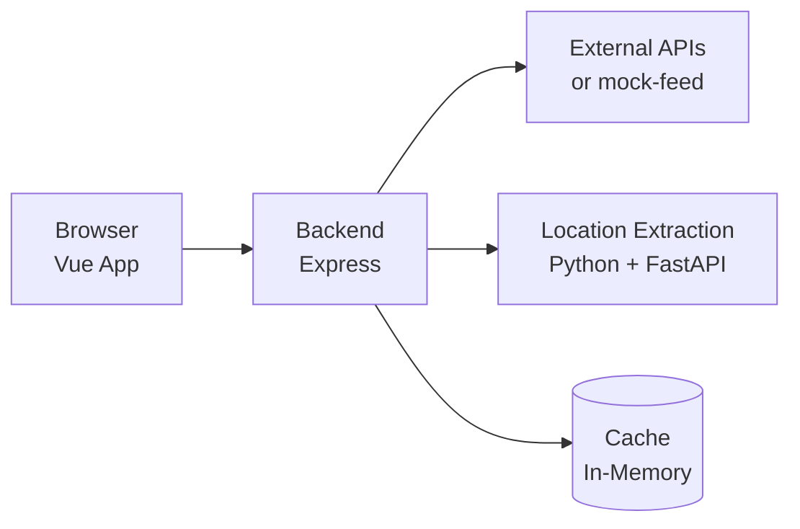
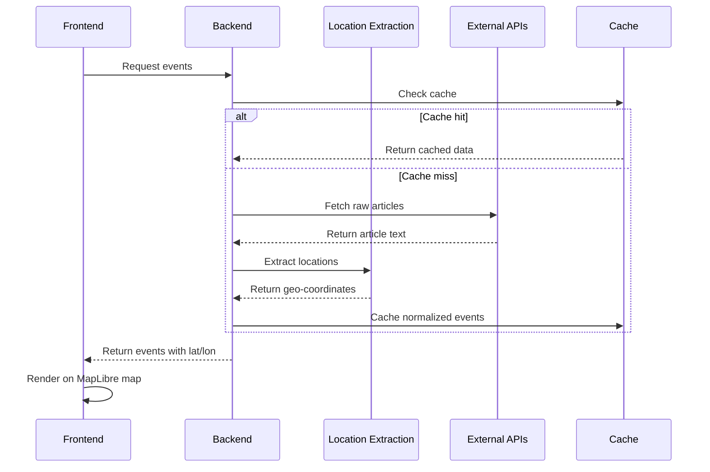

# Living Map - Architecture Overview

## Overview

A real-time web application displaying geographical events on an interactive map. Designed for mobile-first viewing with public, read-only access.

## Technology Stack

| Layer               | Technology        | Notes                                            |
| ------------------- | ----------------- | ------------------------------------------------ |
| Frontend            | Vue 3 + Vite      | Lightweight, mobile-optimized                    |
| Map                 | MapLibre GL JS    | Open-source, OSM tiles                           |
| State Management    | Pinia             | Official Vue recommendation                      |
| Backend             | Node.js + Express | Lightweight API for data aggregation             |
| Location Extraction | Python + FastAPI  | NLP service for extracting coordinates from text |
| External Data       | External APIs     | Real news/event feeds (mock-feed for testing)    |

## High-Level Architecture



**Note**: `mock-feed` (port 3001) is a standalone service that simulates an external RSS feed for testing. The Location Extraction service is described in detail in [location-extraction.md](./location-extraction.md).

## Frontend Architecture

```
frontend/
├── src/
│   ├── components/      # Reusable UI components
│   ├── views/           # Page-level components
│   ├── stores/          # Pinia stores
│   ├── composables/     # Vue composables (hooks)
│   ├── services/        # API client
│   └── assets/          # Styles, images
```

## Backend Architecture

```
backend/
├── src/
│   ├── routes/          # API endpoints
│   ├── services/        # External API integrations
│   │   └── location-service.ts   # HTTP client for location extraction
│   ├── cache/           # Caching layer
│   └── utils/           # Helpers
├── mock-feed/           # Mock external RSS feed (for testing)
│   ├── src/
│   │   ├── routes/      # /feed endpoint
│   │   └── utils/       # Generator, RSS builder
│   ├── README.md        # End-user documentation
│   └── AGENTS.md        # AI agent instructions
├── location-extraction-service/  # Python NLP microservice
│   ├── src/             # FastAPI application
│   ├── Dockerfile
│   ├── requirements.txt
│   └── README.md
└── .env                 # Configuration (PORT, external API URLs)
```

## Data Flow



1. Frontend requests events from backend API
2. Backend checks cache for existing data
3. If cache miss, fetches from external sources
4. For each article, Location Extraction service processes text → coordinates
5. Backend normalizes and caches the enriched data
6. Frontend renders events as markers on MapLibre map
7. Polling mechanism refreshes data every 60 seconds

## Key Design Decisions

| Decision            | Choice                 | Rationale                                                |
| ------------------- | ---------------------- | -------------------------------------------------------- |
| Map Library         | MapLibre GL JS         | Open-source, no API key, OSM tiles                       |
| Real-time           | Polling (60s)          | MVP simplicity, sufficient for low-update-frequency data |
| Caching             | In-memory (node-cache) | Simple, effective for MVP scale                          |
| Responsive          | Mobile-first CSS       | Essential for mobile-friendly requirement                |
| Location Extraction | spaCy + text2geo       | Offline NLP, zero API costs, global coverage             |

## Constraints & Assumptions

- Public, read-only access (no authentication)
- Small scale (< 1000 concurrent users)
- External API sources: mock-feed (RSS) for testing, real feeds to be added later
- Data freshness: 60-second polling interval acceptable
