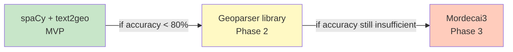

# ADR-001: Location Extraction Approach

## Status

Accepted

## Date

2026-04-12

## Context

Living Map needs to extract geographic locations from unstructured text (news articles) to display events on an interactive map. The system must handle high volume processing with specific constraints.

### Requirements Summary

| Requirement    | Value                                       |
| -------------- | ------------------------------------------- |
| Volume         | 1000+ articles/day                          |
| Latency        | <1s per article                             |
| Coverage       | Global                                      |
| Cost           | $0 (no external APIs)                       |
| Languages      | English (MVP), French (MVP), extensible     |
| Infrastructure | Node.js backend + Python sidecar acceptable |

### Considered Options

| Option               | Cost     | Latency | Accuracy | Multilingual        | Setup        |
| -------------------- | -------- | ------- | -------- | ------------------- | ------------ |
| **spaCy + text2geo** | $0       | <1s     | ~85%     | EN/FR (+extensible) | Easy         |
| Mordecai3            | $0       | <2s     | ~95%     | EN only             | Complex (ES) |
| LLM-based (GPT)      | ~$2/day  | >2s     | ~95%     | Excellent           | Easy         |
| Nominatim API        | $0 (1/s) | varies  | Good     | Limited             | Easy         |
| Geoparser library    | $0       | <1s     | ~90%     | Limited             | Medium       |

## Decision

**Chosen: spaCy + text2geo (Python sidecar service)**

### Architecture


### Components

| Component          | Technology                                 | Notes                      |
| ------------------ | ------------------------------------------ | -------------------------- |
| Language Detection | langdetect                                 | Lightweight, no training   |
| NER                | spaCy `en_core_web_sm` + `fr_core_news_sm` | Small, fast models         |
| Geocoding          | text2geo                                   | Offline, GeoNames-based    |
| API Server         | FastAPI                                    | Async, auto-generated docs |
| Container          | Docker                                     | ~2GB image                 |

### Rationale

1. **Cost**: Fully offline - zero per-request costs even at high volume
2. **Latency**: Python-based NLP + local geocoding achieves <1s target
3. **Infrastructure**: Docker container keeps Python isolated from Node.js
4. **Multilingual**: Easy to extend with additional spaCy models
5. **Accuracy Trade-off**: Acceptable for MVP; upgrade path exists
6. **Simplicity**: No Elasticsearch, no external API dependencies

### Why Not Others

| Option                | Reason for Rejection                                                        |
| --------------------- | --------------------------------------------------------------------------- |
| **Mordecai3**         | Excellent accuracy but requires Elasticsearch (complex ops), English-only   |
| **LLM-based**         | Would cost ~$2/day at volume and latency concerns                           |
| **Nominatim API**     | Free tier has 1 req/s limit; self-hosted requires significant resources     |
| **Geoparser library** | Viable alternative; chosen text2geo for simpler setup and worldwide dataset |

## Consequences

### Positive

- Zero ongoing API costs
- Fast inference (<1s achievable)
- Fully offline, no dependency on external services
- Easy to containerize and deploy
- Simple architecture (4-stage pipeline)
- Extensible multilingual support
- Easy language expansion (just add spaCy models)

### Negative

- Lower accuracy on ambiguous toponyms vs. Mordecai3
- Requires maintaining Python service alongside Node.js
- GeoNames data requires periodic updates (~monthly)
- Two Docker containers to manage (main + location service)

### Neutral

- Need to evaluate accuracy on actual news domain
- May need to upgrade to Geoparser/Mordecai3 if accuracy insufficient

## Accuracy Trade-offs

| Scenario                                 | Expected Behavior                          |
| ---------------------------------------- | ------------------------------------------ |
| Clear location ("flood in Paris")        | ✅ High accuracy (~95%)                    |
| Ambiguous name ("Paris" without context) | ⚠️ May resolve to Paris, France by default |
| Small/local place names                  | ⚠️ Depends on GeoNames coverage            |
| Historic/archaic place names             | ❌ May not resolve                         |

## Upgrade Path



### Mordecai3 Migration Effort

| Aspect              | Effort   | Notes                                        |
| ------------------- | -------- | -------------------------------------------- |
| Elasticsearch setup | 1-2 days | Docker compose, Geonames indexing            |
| Code migration      | 1-2 days | Replace `geocode()` calls with `Geoparser()` |
| Testing             | 3-5 days | Validate accuracy improvements               |
| Infrastructure      | 1 week   | Docker, monitoring, ES needs ~4GB RAM        |

**Code change for Mordecai3 switch:**

```python
# Current (text2geo)
result = geo.geocode(mention["text"])

# Mordecai3 migration
from mordecai3 import Geoparser
geo = Geoparser()  # Uses spaCy + ES + neural model
result = geo.geoparse_doc(text)["geolocated_ents"]
```

## Multilingual Strategy

### MVP Languages

| Language | Model             | Coverage          |
| -------- | ----------------- | ----------------- |
| English  | `en_core_web_sm`  | Small, fast model |
| French   | `fr_core_news_sm` | Small, fast model |

### Future Expansion

| Phase   | Languages                   | Notes                      |
| ------- | --------------------------- | -------------------------- |
| Phase 2 | German, Spanish, Portuguese | European coverage          |
| Phase 3 | Chinese, Japanese, Korean   | Asian languages            |
| Future  | Arabic, Russian, Hindi      | Additional global coverage |

### Adding New Languages

```python
# 1. Download model
# python -m spacy download de_core_news_sm

# 2. Update model map
MODEL_MAP = {
    "en": "en_core_web_sm",
    "fr": "fr_core_news_sm",
    "de": "de_core_news_sm",  # Add here
    "es": "es_core_news_sm",  # Add here
}

# 3. Rebuild Docker image
# docker build -t location-extraction-service .
```

## Key Files for AI Agents

| File                                             | Purpose                            |
| ------------------------------------------------ | ---------------------------------- |
| `design/architecture/location-extraction.md`     | Full technical specification       |
| `backend/location-extraction-service/`           | Python microservice implementation |
| `backend/src/services/location-service.ts`       | Node.js HTTP client                |
| `backend/location-extraction-service/Dockerfile` | Container configuration            |

## Evaluation Criteria

| Metric                   | Target    | Measurement                         |
| ------------------------ | --------- | ----------------------------------- |
| Location extraction rate | >90%      | Articles with at least one location |
| Location accuracy        | >85%      | Correct location for clear mentions |
| Latency p95              | <1 second | Per document processing             |
| API errors               | 0         | Fully offline, no external calls    |

## References

- [spaCy](https://spacy.io/)
- [spaCy Transformer Models](https://spacy.io/models)
- [text2geo](https://github.com/charonviz/text2geo)
- [GeoNames](https://www.geonames.org/)
- [Mordecai3](https://github.com/ahalterman/mordecai3)
- [FastAPI](https://fastapi.tiangolo.com/)
