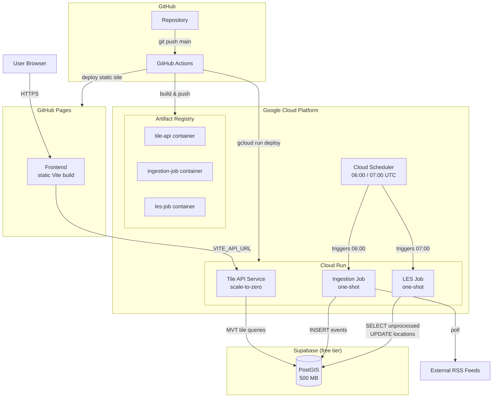
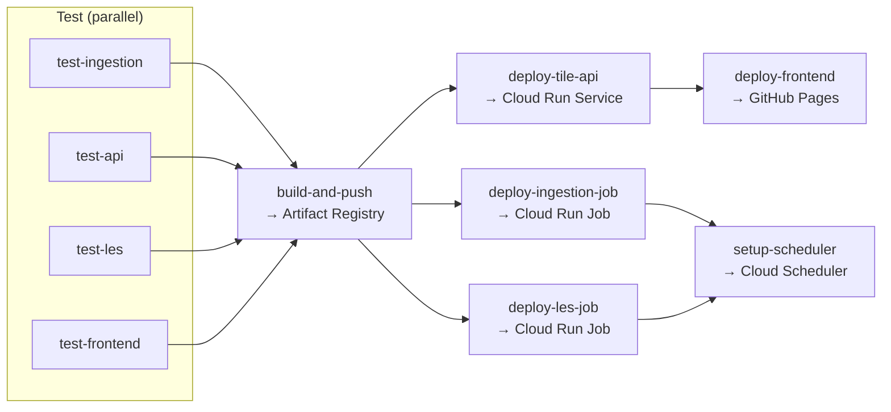

# Living Map — Deployment & Hosting Architecture

**Status:** This document now describes the production deployment on Google Cloud Run + Supabase (per
[ADR-021](../decisions/ADR-021-serverless-free-tier-deployment.md)). The previous Oracle ARM + Coolify
target (the original version of this document) is superseded and kept below for reference.

> **TL;DR:** The project was originally targeting an Oracle Cloud ARM VM managed by Coolify, but ARM
> instances are persistently unavailable (`Out of capacity` across all regions). The strategy changed to
> serverless: GitHub Pages (frontend), Cloud Run Services/Jobs (backend), and Supabase (database).
> See [ADR-021](../decisions/ADR-021-serverless-free-tier-deployment.md) for full rationale.

---

## Table of Contents

1. [Overview](#overview)
2. [Local Development](#current-state-local-development)
3. [Production Architecture (Cloud Run + Supabase)](#production-architecture-cloud-run--supabase)
4. [Container Strategy](#container-strategy)
5. [Environment Configuration](#environment-configuration)
6. [CI/CD Pipeline](#cicd-pipeline)
7. [Database & Backup](#database--backup)
8. [Monitoring](#monitoring)
9. [Cost Breakdown](#cost-breakdown)
10. [Key Design Decisions](#key-design-decisions)
11. [Constraints & Assumptions](#constraints--assumptions)
12. [Runbook](#runbook)
13. [Superseded: Oracle ARM + Coolify Target](#superseded-oracle-arm--coolify-target)

---

## Overview

This document describes the deployment and hosting architecture for the Living Map application. It covers
the local development setup (Docker Compose), the production serverless target infrastructure on Google
Cloud Run + Supabase, the CI/CD pipeline, and operational runbook.

The system runs at **$0/month** using only always-free tiers:

| Component | Platform | Type | Cost |
|---|---|---|---|
| Frontend | GitHub Pages | Static site (Vite build) | $0 |
| Tile API | Cloud Run Service | HTTP, scale-to-zero | $0 |
| Ingestion | Cloud Run Job | One-shot daily cron | $0 |
| LES | Cloud Run Job | One-shot daily cron | $0 |
| Scheduling | Cloud Scheduler | 2 cron triggers | $0 |
| Database | Supabase | Managed PostGIS, 500 MB | $0 |

---

## Current State: Local Development

All services run via Docker Compose on a single host. The compose file at `backend/docker-compose.yml` orchestrates:

| Service               | Image/Build                                              | Port | Dependencies        |
| --------------------- | -------------------------------------------------------- | ---- | ------------------- |
| `postgres`            | `postgis/postgis:16-3.4`                                 | 5432 | —                   |
| `migrate`             | `node:22-alpine` (ephemeral)                             | —    | postgres (healthy)  |
| `ingestion-worker`    | `./ingestion-worker/Dockerfile`                          | —    | migrate (completed) |
| `api`                 | `./api/Dockerfile`                                       | 3002 | migrate (completed) |
| `frontend`            | `../frontend/Dockerfile`                                 | 8080 | api                 |

The Location Extraction Service (LES) runs outside Docker Compose for local dev — invoke the batch script
directly: `uv run python -m src.app` from `backend/location-extraction-service/`.

`mock-feed` runs outside compose — started manually for testing or via Testcontainers in integration tests.

The frontend nginx (`frontend/nginx.conf`) proxies `/tiles/` requests to the api service over the Docker
internal network (local dev only — production uses `VITE_API_URL` pointing to Cloud Run).

---

## Production Architecture (Cloud Run + Supabase)



### Data Flow

**Tile requests:** User browser → GitHub Pages (HTML/JS) → Tile API (Cloud Run Service) → Supabase PostGIS → MVT tiles → MapLibre GL JS render

**Daily ingestion (06:00 UTC):** Cloud Scheduler → triggers `ingestion-job` (Cloud Run Job) → fetch RSS feeds → normalize → INSERT into events table → exit

**Daily NER processing (07:00 UTC):** Cloud Scheduler → triggers `les-job` (Cloud Run Job) → SELECT events WHERE location IS NULL → load spaCy model (once) → batch NER + geocoding → UPDATE locations → exit

### Job Design

| Job | Trigger | Duration | Memory | Env Vars |
|---|---|---|---|---|
| `ingestion-job` | Cloud Scheduler `0 6 * * *` | ~3 min | 512 MB | `DATABASE_URL` |
| `les-job` | Cloud Scheduler `0 7 * * *` | ~5 min | 2 GB (for trf model) | `DATABASE_URL`, `SPACY_EN_MODEL` |

Both jobs are **decoupled** — they communicate only through the database. Ingestion can run without LES
(articles won't have locations), and LES can run without ingestion (no new articles to process).

### Supabase Idle-Pause Mitigation

Supabase free-tier projects auto-pause after 7 days of inactivity. Mitigated by:

1. Daily scheduled jobs generate database activity, naturally resetting the timer
2. If no visitors and jobs are dormant for 7+ days → project pauses → click "Restore" in Supabase dashboard (data is preserved)
3. Optional: external uptime monitor (e.g., cron-job.org free) pinging `/rest/v1/rpc/health` every 6h

---

## Container Strategy

| Service             | Base Image                                           | Build Context               | Notes                                         |
| ------------------- | ---------------------------------------------------- | --------------------------- | --------------------------------------------- |
| Frontend            | `node:22-alpine` (build)                             | `frontend/`                 | Vite build only (no nginx for production)     |
| Tile API            | `node:22-alpine`                                     | `backend/api/`              | Express server, Cloud Run Service             |
| Ingestion Job       | `node:22-alpine`                                     | `backend/ingestion-worker/` | One-shot job entry point                      |
| LES Job             | Python 3.14-slim                                     | `backend/location-extraction-service/` | spaCy models, ~500 MB with `en_core_web_trf` |

### Key Container Notes

- **Ingestion Job:** No HTTP server, no node-cron, no enrichment. Entry point runs all sources once and exits.
- **LES Job:** No FastAPI/uvicorn. Entry point is a batch script: load model → query DB → process → update → exit.
- **Tile API:** Standard Express server. Deployed as Cloud Run Service with `minScale=0`, `startupCpuBoost=true`.
- **Frontend:** Built via `npm run build` in CI, deployed as static files to GitHub Pages. No nginx needed in production.

---

## Environment Configuration

Variables are set per Cloud Run service/job at deploy time (via `--set-env-vars` in CI/CD).

### Frontend (GitHub Pages)

| Variable | Set via | Description |
|---|---|---|
| `VITE_API_URL` | CI build step | Cloud Run tile API URL (e.g., `https://tile-api-xxxxx-uc.a.run.app`) |

### Tile API (Cloud Run Service)

| Variable | Source | Description |
|---|---|---|
| `DATABASE_URL` | GitHub secret | Supabase connection string with `?sslmode=require` |
| `CORS_ORIGIN` | GitHub secret | GitHub Pages URL (e.g., `https://user.github.io`) |
| `PORT` | Cloud Run (auto) | Injected by Cloud Run runtime |

### Ingestion Job (Cloud Run Job)

| Variable | Source | Description |
|---|---|---|
| `DATABASE_URL` | GitHub secret | Supabase connection string with `?sslmode=require` |
| `LOG_LEVEL` | Hardcoded | `info` |

### LES Job (Cloud Run Job)

| Variable | Source | Description |
|---|---|---|
| `DATABASE_URL` | GitHub secret | Supabase connection string with `?sslmode=require` |
| `SPACY_EN_MODEL` | Hardcoded | `en_core_web_sm` (or `en_core_web_trf` for transformer) |
| `SPACY_FR_MODEL` | Hardcoded | `fr_core_news_sm` |

---

## CI/CD Pipeline

Deployment is automated via **GitHub Actions** (`.github/workflows/deploy.yml`).

### Pipeline Jobs



### Trigger

On every push to `main` branch.

### Breakdown

| Job | Description |
|---|---|
| `test-ingestion` | `npm ci && npm test` in `backend/ingestion-worker/` |
| `test-api` | `npm ci && npm test` in `backend/api/` |
| `test-les` | `uv sync --frozen && uv run pytest -m "not model_dependent"` in `backend/location-extraction-service/` |
| `test-frontend` | `npm ci && npm test && npm run build` in `frontend/` |
| `build-and-push` | Build 3 container images → push to Artifact Registry with `latest` + `${{ github.sha }}` tags |
| `deploy-tile-api` | `gcloud run deploy tile-api ... --min-instances=0 --cpu-boost` |
| `deploy-ingestion-job` | `gcloud run jobs deploy ingestion-job ...` |
| `deploy-les-job` | `gcloud run jobs deploy les-job ... --memory=2Gi` |
| `deploy-frontend` | Build with VITE_API_URL → `peaceiris/actions-gh-pages` |
| `setup-scheduler` | Create/update Cloud Scheduler jobs for 06:00 and 07:00 UTC triggers |

---

## Database & Backup

**Database:** Supabase (managed PostgreSQL + PostGIS). Free tier: 500 MB database, 5 GB bandwidth/month.

**Backup strategy:**
1. Supabase provides automated daily backups on all plans (including free tier)
2. Deletion of Supabase project is the only data loss vector — no local backup needed
3. Application data is reproducible: all events come from external RSS feeds

**Capacity:** At ~1 KB/article, 500 MB holds ~500K events. Monitor growth in Supabase dashboard.

---

## Monitoring

| Capability | Tool | Notes |
|---|---|---|
| Cloud Run logs | Google Cloud Logging | Built-in, per-request structured logs |
| Cloud Run metrics | Google Cloud Monitoring | Request count, latency, CPU, memory |
| Job execution logs | `gcloud run jobs executions list` | Per-execution logs for ingestion and LES |
| Supabase status | Supabase dashboard | DB size, active connections, query performance |
| Service health | Tile API `/health` endpoint | Returns `{"status":"ok"}` when DB is reachable |

No external monitoring service required at this scale. Google Cloud's free-tier observability is sufficient.

---

## Cost Breakdown

| Resource | Cost | Notes |
|---|---|---|
| GitHub Pages | $0/mo | Unlimited static hosting with CDN |
| Cloud Run | $0/mo | 2M req/mo, 360K GB-s, 180K vCPU-s — usage is well under limits |
| Artifact Registry | $0/mo | 500 MB free storage |
| Cloud Scheduler | $0/mo | 3 free jobs, using 2 |
| Supabase | $0/mo | 500 MB database, 5 GB bandwidth |
| Domain name | $0–$12/yr | Free subdomain or ~$12/yr for custom domain |
| **Total** | **$0–$1/mo** | Domain registration is the only potential cost |

### Free-Tier Headroom

| Resource | Monthly Usage | Free Limit | Headroom |
|---|---|---|---|
| Cloud Run GB-seconds | ~21,600 | 360,000 | 94% free |
| Cloud Run vCPU-seconds | ~12,000 | 180,000 | 93% free |
| Cloud Run requests | ~1,500 | 2,000,000 | 99.9% free |
| Supabase storage | < 500 MB | 500 MB | Monitor growth |
| Supabase bandwidth | < 1 GB | 5 GB | 80% free |

---

## Key Design Decisions

| Decision | Choice | Rationale |
|---|---|---|
| Compute provider | Google Cloud Run | Always-free tier with 8 GB RAM (supports spaCy transformer model) |
| Database | Supabase | Managed PostGIS, pre-installed, 500 MB free tier, auto-pauses after 7d idle |
| Frontend hosting | GitHub Pages | Global CDN, automatic HTTPS, git-push deploy, $0 |
| Scheduling | Cloud Scheduler | 3 free jobs, direct Cloud Run Job trigger via OAuth |
| Inter-service comm | Database (shared PostGIS) | Decoupled jobs, independent failure domains, no HTTP calls between jobs |
| CI/CD | GitHub Actions | Native integration, free for public repos, gcloud auth via Workload Identity |

---

## Constraints & Assumptions

- Cloud Run may cold-start for the tile API after idle (1-3s) — acceptable for portfolio traffic
- Supabase pauses after 7 days of inactivity — mitigated by daily cron jobs; manual restore if needed
- 500 MB database limit — hold events to ~500K articles; purge old events if necessary
- Batch processing is not real-time — new articles wait for the next daily run
- Cloud Run free tier limits are sufficient for current traffic (single user, portfolio traffic)
- Cloud Run-to-Supabase traffic goes over public internet (~10-30ms added latency)

---

## Runbook

### Initial Setup (one-time)

```bash
# 1. Create Supabase project at https://supabase.com
# 2. Create GCP project, enable APIs:
gcloud services enable run.googleapis.com artifactregistry.googleapis.com cloudscheduler.googleapis.com
# 3. Create Artifact Registry repository:
gcloud artifacts repositories create living-map --repository-format=docker --location=us-central1
# 4. Create service account with roles run.admin, cloudscheduler.admin, artifactregistry.writer
# 5. Add GitHub secrets (GCP_SA_KEY, GCP_PROJECT_ID, GCP_REGION, SUPABASE_DATABASE_URL, etc.)
# 6. Push to main — GitHub Actions handles the rest
```

### Daily Operations

| Task | How |
|---|---|
| Check ingestion ran | `gcloud run jobs executions list --job=ingestion-job --region=REGION` |
| Check LES ran | `gcloud run jobs executions list --job=les-job --region=REGION` |
| View job logs | `gcloud beta run jobs logs read --job=ingestion-job --region=REGION` |
| Manually trigger ingestion | `gcloud run jobs execute ingestion-job --region=REGION` |
| Manually trigger LES | `gcloud run jobs execute les-job --region=REGION` |
| Force re-process events | Connect to Supabase: `UPDATE events SET location = NULL WHERE ...`, then trigger LES |
| Check DB size | Supabase dashboard → Database → Database size |

### Recovery

| Scenario | Recovery |
|---|---|
| Cloud Run job fails | Check logs in Google Cloud Logging. Fix and re-deploy. |
| Supabase project paused | Click "Restore project" in Supabase dashboard. Data is preserved. |
| Supabase DB full | Purge old events or upgrade to Pro ($25/mo, 8 GB). |
| Corrupted data | Events are reproducible from RSS feeds. Delete and re-ingest. |
| Service account key rotated | Update `GCP_SA_KEY` GitHub secret. |

---

## Superseded: Oracle ARM + Coolify Target

> The following section documents the **original** deployment strategy, superseded by ADR-021 due to
> persistent unavailability of Oracle Cloud ARM instances. The OCI Terraform configs in `infra/terraform/`
> are kept for reference.

### Original Target Infrastructure

| Layer | Choice | Rationale |
|---|---|---|
| Compute | Oracle Cloud Always Free (VM.Standard.A1.Flex) | 4 OCPUs, 24 GB RAM — $0/mo |
| Platform | Coolify (self-hosted) | Git-push deploys, auto SSL |
| Container Runtime | Docker Engine + Docker Compose | Consistent with local dev |
| Reverse Proxy | Traefik (managed by Coolify) | Auto Let's Encrypt SSL |

### Why It Was Abandoned

Oracle Cloud's ARM instances (`VM.Standard.A1.Flex`) are **never available** — the `Out of capacity` error
persists across all regions. The always-free AMD instances (1 OCPU, 1 GB RAM) are insufficient for the
full stack, especially the Location Extraction Service with spaCy models (~500 MB on disk, ~2 GB RAM
for the transformer model).

### Superseded Docs

- `infra/terraform/` — OCI Terraform provisioning (kept for reference)
- `infra/terraform/scripts/configure-coolify.sh` — Coolify post-provisioning
- `infra/terraform/scripts/retry-apply.sh` — OCI ARM retry loop across availability domains

---

## Related Documentation

- [ADR-021: Serverless Free-Tier Deployment](../decisions/ADR-021-serverless-free-tier-deployment.md) — full rationale and options considered
- [Architecture Overview](overview.md) — system architecture and data flow
- [Serving API](serving-api.md) — Express + PostGIS MVT tile generation
- [Ingestion Worker](ingestion-worker.md) — RSS feed ingestion pipeline
- [Location Extraction](location-extraction.md) — spaCy NER + geocoding pipeline
- [Frontend](frontend.md) — Vue 3 + MapLibre GL JS application
- [Ingestion Worker DB Schema](ingestion-worker-db-schema.md) — events and sources tables
- [CONTEXT.md](../../CONTEXT.md) — step-by-step plan for applying ADR-021 changes
