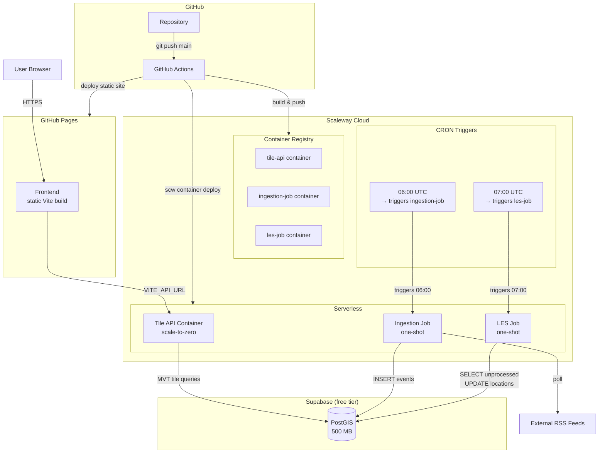
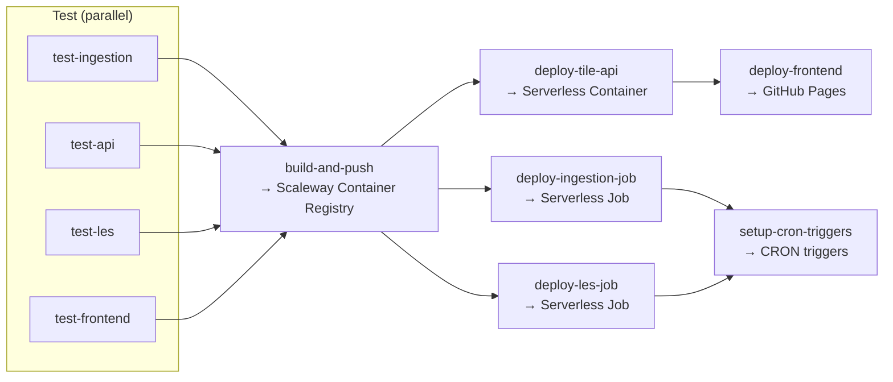

# Living Map — Deployment & Hosting Architecture

**Status:** This document now describes the production deployment on **Scaleway Serverless + Supabase** (per
[ADR-022](../decisions/ADR-022-scaleway-serverless-deployment.md)). The previous Google Cloud Run target
(ADR-021) and the original Oracle ARM + Coolify target are both superseded and kept below for reference.

> **TL;DR:** The project started with Oracle Cloud ARM (unavailable), then targeted Google Cloud Run
> (requires 10€ prepayment), and now runs on **Scaleway Serverless**: GitHub Pages (frontend),
> Scaleway Serverless Containers/Jobs (backend), and Supabase (database).
> See [ADR-022](../decisions/ADR-022-scaleway-serverless-deployment.md) for full rationale.

---

## Table of Contents

1. [Overview](#overview)
2. [Local Development](#current-state-local-development)
3. [Production Architecture (Scaleway + Supabase)](#production-architecture-scaleway--supabase)
4. [Container Strategy](#container-strategy)
5. [Environment Configuration](#environment-configuration)
6. [CI/CD Pipeline](#cicd-pipeline)
7. [Database & Backup](#database--backup)
8. [Monitoring](#monitoring)
9. [Cost Breakdown](#cost-breakdown)
10. [Key Design Decisions](#key-design-decisions)
11. [Constraints & Assumptions](#constraints--assumptions)
12. [Runbook](#runbook)
13. [Superseded: Google Cloud Run + Supabase Target](#superseded-google-cloud-run--supabase-target)
14. [Superseded: Oracle ARM + Coolify Target](#superseded-oracle-arm--coolify-target)

---

## Overview

This document describes the deployment and hosting architecture for the Living Map application. It covers
the local development setup (Docker Compose), the production serverless target infrastructure on Scaleway
Serverless + Supabase, the CI/CD pipeline, and operational runbook.

The system runs at **$0/month** using only always-free tiers:

| Component | Platform | Type | Cost |
|---|---|---|---|
| Frontend | GitHub Pages | Static site (Vite build) | $0 |
| Tile API | Scaleway Serverless Container | HTTP, scale-to-zero | $0 |
| Ingestion | Scaleway Serverless Job | One-shot daily cron | $0 |
| LES | Scaleway Serverless Job | One-shot daily cron | $0 |
| Scheduling | Scaleway Container CRON triggers | 2 cron triggers | $0 |
| Database | Supabase | Managed PostGIS, 500 MB | $0 |

---

## Current State: Local Development

All services run via Docker Compose on a single host. The compose file at `backend/docker-compose.yml` orchestrates:

| Service | Image/Build | Port | Dependencies |
| ------- | -------------------------------------------------------- | ---- | ------------------- |
| `postgres` | `postgis/postgis:16-3.4` | 5432 | — |
| `migrate` | `node:22-alpine` (ephemeral) | — | postgres (healthy) |
| `ingestion-worker` | `./ingestion-worker/Dockerfile` | — | migrate (completed) |
| `api` | `./api/Dockerfile` | 3002 | migrate (completed) |
| `frontend` | `../frontend/Dockerfile` | 8080 | api |

The Location Extraction Service (LES) runs outside Docker Compose for local dev — invoke the batch script
directly: `uv run python -m src.app` from `backend/location-extraction-service/`.

`mock-feed` runs outside compose — started manually for testing or via Testcontainers in integration tests.

The frontend nginx (`frontend/nginx.conf`) proxies `/tiles/` requests to the api service over the Docker
internal network (local dev only — production uses `VITE_API_URL` pointing to the Scaleway Serverless Container).

---

## Production Architecture (Scaleway + Supabase)



### Data Flow

**Tile requests:** User browser → GitHub Pages (HTML/JS) → Tile API (Scaleway Serverless Container) → Supabase PostGIS → MVT tiles → MapLibre GL JS render

**Daily ingestion (06:00 UTC):** CRON trigger → triggers `ingestion-job` (Serverless Job) → fetch RSS feeds → normalize → INSERT into events table → exit

**Daily NER processing (07:00 UTC):** CRON trigger → triggers `les-job` (Serverless Job) → SELECT events WHERE location IS NULL → load spaCy model (once) → batch NER + geocoding → UPDATE locations → exit

### Job Design

| Job | Trigger | Duration | Memory | Env Vars |
|---|---|---|---|---|
| `ingestion-job` | CRON `0 6 * * *` | ~3 min | 512 MB | `DATABASE_URL` |
| `les-job` | CRON `0 7 * * *` | ~5 min | 2 GB (for trf model) | `DATABASE_URL`, `SPACY_EN_MODEL` |

Both jobs are **decoupled** — they communicate only through the database. Ingestion can run without LES
(articles won't have locations), and LES can run without ingestion (no new articles to process).

### Supabase Idle-Pause Mitigation

Supabase free-tier projects auto-pause after 7 days of inactivity. Mitigated by:

1. Daily scheduled jobs generate database activity, naturally resetting the timer
2. If no visitors and jobs are dormant for 7+ days → project pauses → click "Restore" in Supabase dashboard (data is preserved)
3. Optional: external uptime monitor (e.g., cron-job.org free) pinging `/rest/v1/rpc/health` every 6h

---

## Container Strategy

| Service | Base Image | Build Context | Notes |
| ------- | ---------------------------------------------------- | --------------------------- | --------------------------------------------- |
| Frontend | `node:22-alpine` (build) | `frontend/` | Vite build only (no nginx for production) |
| Tile API | `node:22-alpine` | `backend/api/` | Express server, deployed as Serverless Container |
| Ingestion Job | `node:22-alpine` | `backend/ingestion-worker/` | One-shot job entry point |
| LES Job | Python 3.14-slim | `backend/location-extraction-service/` | spaCy models, ~500 MB with `en_core_web_trf` |

### Key Container Notes

- **Ingestion Job:** No HTTP server, no node-cron, no enrichment. Entry point runs all sources once and exits.
- **LES Job:** No FastAPI/uvicorn. Entry point is a batch script: load model → query DB → process → update → exit.
- **Tile API:** Standard Express server. Deployed as Scaleway Serverless Container with `min-scale=0`, `max-scale=1`.
- **Frontend:** Built via `npm run build` in CI, deployed as static files to GitHub Pages. No nginx needed in production.

---

## Environment Configuration

Variables are set per Scaleway container/job at deploy time (via `env.KEY=VALUE` in CI/CD).

### Frontend (GitHub Pages)

| Variable | Set via | Description |
|---|---|---|
| `VITE_API_URL` | CI build step | Scaleway container URL (e.g., `https://tile-api-xxxxx.containers.fr-par.scw.cloud`) |

### Tile API (Scaleway Serverless Container)

| Variable | Source | Description |
|---|---|---|
| `DATABASE_URL` | GitHub secret | Supabase connection string with `?sslmode=require` |
| `CORS_ORIGIN` | GitHub secret | GitHub Pages URL (e.g., `https://user.github.io`) |
| `PORT` | Scaleway (auto) | Injected by Scaleway runtime |

### Ingestion Job (Scaleway Serverless Job)

| Variable | Source | Description |
|---|---|---|
| `DATABASE_URL` | GitHub secret | Supabase connection string with `?sslmode=require` |
| `LOG_LEVEL` | Hardcoded | `info` |

### LES Job (Scaleway Serverless Job)

| Variable | Source | Description |
|---|---|---|
| `DATABASE_URL` | GitHub secret | Supabase connection string with `?sslmode=require` |
| `SPACY_EN_MODEL` | Hardcoded | `en_core_web_sm` (or `en_core_web_trf` for transformer) |
| `SPACY_FR_MODEL` | Hardcoded | `fr_core_news_sm` |

---

## CI/CD Pipeline

Deployment is automated via **GitHub Actions** (`.github/workflows/deploy.yml`).

### Pipeline Jobs



### Trigger

On every push to `main` branch.

### Breakdown

| Job | Description |
|---|---|
| `test-ingestion` | `npm ci && npm test` in `backend/ingestion-worker/` |
| `test-api` | `npm ci && npm test` in `backend/api/` |
| `test-les` | `uv sync --frozen && uv run pytest -m "not model_dependent"` in `backend/location-extraction-service/` |
| `test-frontend` | `npm ci && npm test && npm run build` in `frontend/` |
| `build-and-push` | Build 3 container images → push to Scaleway Container Registry with `latest` + `${{ github.sha }}` tags |
| `deploy-tile-api` | `scw container container create/update` with scale-to-zero |
| `deploy-ingestion-job` | `scw container job create/update` for one-shot job |
| `deploy-les-job` | `scw container job create/update --memory-limit=2048` |
| `deploy-frontend` | Build with VITE_API_URL → `peaceiris/actions-gh-pages` |
| `setup-cron-triggers` | Create/update CRON triggers for 06:00 and 07:00 UTC on jobs |

### Example CI Workflow (Scaleway)

The tests and frontend deploy jobs are identical to the GCP version. The build-and-push and deploy jobs change:

```yaml
build-and-push:
  needs: [test-ingestion, test-api, test-les, test-frontend]
  runs-on: ubuntu-latest
  steps:
    - uses: actions/checkout@v4
    - name: Install scw CLI
      run: |
        curl -o scw -sL "https://github.com/scaleway/scaleway-cli/releases/latest/download/scw-$(uname -s | tr '[:upper:]' '[:lower:]')-$(uname -m)"
        chmod +x scw && sudo mv scw /usr/local/bin/scw
    - name: Configure scw
      run: scw init access-key=${{ secrets.SCW_ACCESS_KEY }} secret-key=${{ secrets.SCW_SECRET_KEY }} organization-id=${{ secrets.SCW_ORGANIZATION_ID }} project-id=${{ secrets.SCW_PROJECT_ID }} send-telemetry=false
    - name: Login to Container Registry
      run: scw registry login
    - name: Build & push tile-api
      run: |
        docker build -t rg.fr-par.scw.cloud/living-map/tile-api:${{ github.sha }} -t rg.fr-par.scw.cloud/living-map/tile-api:latest backend/api
        docker push --all-tags rg.fr-par.scw.cloud/living-map/tile-api
    - name: Build & push ingestion-job
      run: |
        docker build -t rg.fr-par.scw.cloud/living-map/ingestion-job:${{ github.sha }} -t rg.fr-par.scw.cloud/living-map/ingestion-job:latest backend/ingestion-worker
        docker push --all-tags rg.fr-par.scw.cloud/living-map/ingestion-job
    - name: Build & push les-job
      run: |
        docker build -t rg.fr-par.scw.cloud/living-map/les-job:${{ github.sha }} -t rg.fr-par.scw.cloud/living-map/les-job:latest backend/location-extraction-service
        docker push --all-tags rg.fr-par.scw.cloud/living-map/les-job

deploy-tile-api:
  needs: [build-and-push]
  runs-on: ubuntu-latest
  outputs:
    url: ${{ steps.deploy.outputs.url }}
  steps:
    - name: Install & configure scw
      run: |
        curl -o scw -sL "https://github.com/scaleway/scaleway-cli/releases/latest/download/scw-$(uname -s | tr '[:upper:]' '[:lower:]')-$(uname -m)"
        chmod +x scw && sudo mv scw /usr/local/bin/scw
        scw init access-key=${{ secrets.SCW_ACCESS_KEY }} secret-key=${{ secrets.SCW_SECRET_KEY }} organization-id=${{ secrets.SCW_ORGANIZATION_ID }} project-id=${{ secrets.SCW_PROJECT_ID }} send-telemetry=false
    - id: deploy
      run: |
        scw container container create \
          namespace-id=${{ secrets.SCW_NAMESPACE_ID }} \
          name=tile-api \
          registry-image=rg.fr-par.scw.cloud/living-map/tile-api:${{ github.sha }} \
          min-scale=0 max-scale=1 \
          memory-limit=256 \
          privacy=public \
          env.DATABASE_URL=${{ secrets.SUPABASE_DATABASE_URL }} \
          env.CORS_ORIGIN=${{ secrets.CORS_ORIGIN }} \
          2>/dev/null || \
        scw container container update ${{ secrets.SCW_NAMESPACE_ID }}/tile-api \
          registry-image=rg.fr-par.scw.cloud/living-map/tile-api:${{ github.sha }} \
          env.DATABASE_URL=${{ secrets.SUPABASE_DATABASE_URL }} \
          env.CORS_ORIGIN=${{ secrets.CORS_ORIGIN }}
        echo "url=$(scw container container get ${{ secrets.SCW_NAMESPACE_ID }}/tile-api -o json | jq -r '.status.url')" >> $GITHUB_OUTPUT

deploy-ingestion-job:
  needs: [build-and-push]
  runs-on: ubuntu-latest
  steps:
    - name: Install & configure scw
      run: |
        curl -o scw -sL "https://github.com/scaleway/scaleway-cli/releases/latest/download/scw-$(uname -s | tr '[:upper:]' '[:lower:]')-$(uname -m)"
        chmod +x scw && sudo mv scw /usr/local/bin/scw
        scw init access-key=${{ secrets.SCW_ACCESS_KEY }} secret-key=${{ secrets.SCW_SECRET_KEY }} organization-id=${{ secrets.SCW_ORGANIZATION_ID }} project-id=${{ secrets.SCW_PROJECT_ID }} send-telemetry=false
    - run: |
        scw container job create \
          namespace-id=${{ secrets.SCW_NAMESPACE_ID }} \
          name=ingestion-job \
          registry-image=rg.fr-par.scw.cloud/living-map/ingestion-job:${{ github.sha }} \
          memory-limit=512 \
          env.DATABASE_URL=${{ secrets.SUPABASE_DATABASE_URL }} \
          2>/dev/null || \
        scw container job update ${{ secrets.SCW_NAMESPACE_ID }}/ingestion-job \
          registry-image=rg.fr-par.scw.cloud/living-map/ingestion-job:${{ github.sha }} \
          env.DATABASE_URL=${{ secrets.SUPABASE_DATABASE_URL }}

deploy-les-job:
  needs: [build-and-push]
  runs-on: ubuntu-latest
  steps:
    - name: Install & configure scw
      run: |
        curl -o scw -sL "https://github.com/scaleway/scaleway-cli/releases/latest/download/scw-$(uname -s | tr '[:upper:]' '[:lower:]')-$(uname -m)"
        chmod +x scw && sudo mv scw /usr/local/bin/scw
        scw init access-key=${{ secrets.SCW_ACCESS_KEY }} secret-key=${{ secrets.SCW_SECRET_KEY }} organization-id=${{ secrets.SCW_ORGANIZATION_ID }} project-id=${{ secrets.SCW_PROJECT_ID }} send-telemetry=false
    - run: |
        scw container job create \
          namespace-id=${{ secrets.SCW_NAMESPACE_ID }} \
          name=les-job \
          registry-image=rg.fr-par.scw.cloud/living-map/les-job:${{ github.sha }} \
          memory-limit=2048 \
          env.DATABASE_URL=${{ secrets.SUPABASE_DATABASE_URL }} \
          2>/dev/null || \
        scw container job update ${{ secrets.SCW_NAMESPACE_ID }}/les-job \
          registry-image=rg.fr-par.scw.cloud/living-map/les-job:${{ github.sha }} \
          env.DATABASE_URL=${{ secrets.SUPABASE_DATABASE_URL }}

setup-cron-triggers:
  needs: [deploy-ingestion-job, deploy-les-job]
  runs-on: ubuntu-latest
  steps:
    - name: Install & configure scw
      run: |
        curl -o scw -sL "https://github.com/scaleway/scaleway-cli/releases/latest/download/scw-$(uname -s | tr '[:upper:]' '[:lower:]')-$(uname -m)"
        chmod +x scw && sudo mv scw /usr/local/bin/scw
        scw init access-key=${{ secrets.SCW_ACCESS_KEY }} secret-key=${{ secrets.SCW_SECRET_KEY }} organization-id=${{ secrets.SCW_ORGANIZATION_ID }} project-id=${{ secrets.SCW_PROJECT_ID }} send-telemetry=false
    - name: Create or update ingestion cron
      run: |
        CRON_ID=$(scw container cron list -o json | jq -r '.crons[] | select(.container_id == "ingestion-job") | .id' | head -1)
        if [ -z "$CRON_ID" ]; then
          scw container cron create \
            container-id=$(scw container job list -o json | jq -r '.jobs[] | select(.name == "ingestion-job") | .id') \
            schedule="0 6 * * *" \
            args="{}"
        else
          scw container cron update $CRON_ID schedule="0 6 * * *"
        fi
    - name: Create or update LES cron
      run: |
        CRON_ID=$(scw container cron list -o json | jq -r '.crons[] | select(.container_id == "les-job") | .id' | head -1)
        if [ -z "$CRON_ID" ]; then
          scw container cron create \
            container-id=$(scw container job list -o json | jq -r '.jobs[] | select(.name == "les-job") | .id') \
            schedule="0 7 * * *" \
            args="{}"
        else
          scw container cron update $CRON_ID schedule="0 7 * * *"
        fi
```

---

## Database & Backup

**Database:** Supabase (managed PostgreSQL + PostGIS). Free tier: 500 MB database, 5 GB bandwidth/month.

**Backup strategy:**
1. Supabase provides automated daily backups on all plans (including free tier)
2. Deletion of Supabase project is the only data loss vector — no local backup needed
3. Application data is reproducible: all events come from external RSS feeds

**Capacity:** At ~1 KB/article, 500 MB holds ~500K events. Monitor growth in Supabase dashboard.

---

## Monitoring

| Capability | Tool | Notes |
|---|---|---|
| Container logs | Scaleway Console / `scw container logs` | Built-in, per-request structured logs |
| Container metrics | Scaleway Console | Request count, latency, CPU, memory |
| Job execution logs | `scw container job list` | Per-execution logs for ingestion and LES |
| Supabase status | Supabase dashboard | DB size, active connections, query performance |
| Service health | Tile API `/health` endpoint | Returns `{"status":"ok"}` when DB is reachable |

No external monitoring service required at this scale. The Scaleway console provides sufficient observability.

---

## Cost Breakdown

| Resource | Cost | Notes |
|---|---|---|
| GitHub Pages | $0/mo | Unlimited static hosting with CDN |
| Scaleway Serverless | $0/mo | 400K GB-s, 200K vCPU-s — usage is well under limits (see headroom below) |
| Scaleway Container Registry | $0/mo | 500 MB free storage |
| Supabase | $0/mo | 500 MB database, 5 GB bandwidth |
| Domain name | $0–$12/yr | Free subdomain or ~$12/yr for custom domain |
| **Total** | **$0–$1/mo** | Domain registration is the only potential cost |

### Free-Tier Headroom

Scaleway's free tier is pooled across all serverless products (containers + jobs + functions):

| Resource | Monthly Usage | Free Limit | Headroom |
|---|---|---|---|
| GB-seconds | ~21,600 (LES 18K + ingestion 2.7K + tile API ~1K) | 400,000 | 94.6% free |
| vCPU-seconds | ~12,000 | 200,000 | 94% free |
| Supabase storage | < 500 MB | 500 MB | Monitor growth |
| Supabase bandwidth | < 1 GB | 5 GB | 80% free |

---

## Key Design Decisions

| Decision | Choice | Rationale |
|---|---|---|
| Compute provider | Scaleway Serverless | Always-free tier (400K GB-s / 200K vCPU-s), supports spaCy transformer model at 2 GB RAM, no upfront payment |
| Database | Supabase | Managed PostGIS, pre-installed, 500 MB free tier, auto-pauses after 7d idle |
| Frontend hosting | GitHub Pages | Global CDN, automatic HTTPS, git-push deploy, $0 |
| Scheduling | Scaleway CRON triggers | Built-in, no separate service needed, free |
| Inter-service comm | Database (shared PostGIS) | Decoupled jobs, independent failure domains, no HTTP calls between jobs |
| CI/CD | GitHub Actions | Native integration, free for public repos, scw auth via API keys |

---

## Constraints & Assumptions

- Scaleway Serverless Container may cold-start for the tile API after idle (1-3s) — acceptable for portfolio traffic
- Supabase pauses after 7 days of inactivity — mitigated by daily cron jobs; manual restore if needed
- 500 MB database limit — hold events to ~500K articles; purge old events if necessary
- Batch processing is not real-time — new articles wait for the next daily run
- Scaleway free tier limits are sufficient for current traffic (single user, portfolio traffic)
- Scaleway-to-Supabase traffic goes over public internet (~10-30ms added latency)
- Scaleway free tier is per-account, not per-project — all serverless usage in the account shares the same 400K GB-s / 200K vCPU-s pool
- No startup CPU boost on Scaleway (unlike Cloud Run) — cold starts for LES model loading may be slightly slower

---

## Runbook

### Initial Setup (one-time)

```bash
# 1. Create Supabase project at https://supabase.com
# 2. Create Scaleway account at https://console.scaleway.com
# 3. Install scw CLI:
curl -o scw -sL "https://github.com/scaleway/scaleway-cli/releases/latest/download/scw-$(uname -s | tr '[:upper:]' '[:lower:]')-$(uname -m)"
chmod +x scw && sudo mv scw /usr/local/bin/scw
# 4. Generate API keys in Scaleway console → IAM → API Keys
# 5. Initialize scw:
scw init access-key=<ACCESS_KEY> secret-key=<SECRET_KEY> organization-id=<ORGANIZATION_ID> project-id=<PROJECT_ID>
# 6. Create Container Registry namespace:
scw registry namespace create name=living-map
# 7. Create Serverless Container namespace:
scw container namespace create name=living-map
# 8. Add GitHub secrets (SCW_ACCESS_KEY, SCW_SECRET_KEY, SCW_PROJECT_ID, SCW_ORGANIZATION_ID, SCW_NAMESPACE_ID, SUPABASE_DATABASE_URL, etc.)
# 9. Push to main — GitHub Actions handles the rest
```

### Daily Operations

| Task | How |
|---|---|
| Check ingestion ran | `scw container job list --order-by=created_at_desc | jq '.jobs[] | select(.name=="ingestion-job")'` |
| Check LES ran | `scw container job list --order-by=created_at_desc | jq '.jobs[] | select(.name=="les-job")'` |
| View job logs | Scaleway Console → Serverless Jobs → select job → Logs tab |
| Manually trigger ingestion | `scw container job start <JOB_ID>` (get ID from `scw container job list`) |
| Manually trigger LES | `scw container job start <JOB_ID>` |
| Force re-process events | Connect to Supabase: `UPDATE events SET location = NULL WHERE ...`, then trigger LES |
| Check DB size | Supabase dashboard → Database → Database size |
| View container logs | `scw container logs <CONTAINER_ID>` |

### Recovery

| Scenario | Recovery |
|---|---|
| Serverless Job fails | Check logs in Scaleway Console. Fix and re-deploy. |
| Supabase project paused | Click "Restore project" in Supabase dashboard. Data is preserved. |
| Supabase DB full | Purge old events or upgrade to Pro ($25/mo, 8 GB). |
| Corrupted data | Events are reproducible from RSS feeds. Delete and re-ingest. |
| API keys rotated | Update `SCW_ACCESS_KEY` / `SCW_SECRET_KEY` GitHub secrets. |

---

## Superseded: Google Cloud Run + Supabase Target

> The following section documents the **Cloud Run** deployment strategy, superseded by ADR-022 due to
> GCP's 10€ refundable prepayment requirement.

This architecture was proposed in ADR-021 and used the same component decomposition but deployed on Google
Cloud Run Services/Jobs with Cloud Scheduler and Artifact Registry. The containers, environment variables,
and data flow were identical to the current Scaleway architecture — only the provider CLI (`gcloud` vs `scw`),
registry URLs, and free-tier limits differed.

| Component | Platform | Notes |
|---|---|---|
| Tile API | Cloud Run Service (scale-to-zero) | startupCpuBoost=true, >256 MB |
| Ingestion | Cloud Run Job (one-shot) | Cloud Scheduler `0 6 * * *` |
| LES | Cloud Run Job (one-shot) | Cloud Scheduler `0 7 * * *`, 2 GB memory |
| Scheduling | Cloud Scheduler | 3 free jobs, OAuth-based auth |
| Container Registry | Artifact Registry | `REGION-docker.pkg.dev/PROJECT/living-map/IMAGE` |

### Why It Was Abandoned

GCP requires a **refundable 10€ prepayment** to create a billing account, which is necessary to use
Cloud Run, Cloud Scheduler, and Artifact Registry. Although the prepayment is refundable and the
services would stay within the free tier, the user prefers a provider with no upfront payment requirement.

---

## Superseded: Oracle ARM + Coolify Target

> The following section documents the **original** deployment strategy, superseded by ADR-021 due to
> persistent unavailability of Oracle Cloud ARM instances.

### Original Target Infrastructure

| Layer | Choice | Rationale |
|---|---|---|
| Compute | Oracle Cloud Always Free (VM.Standard.A1.Flex) | 4 OCPUs, 24 GB RAM — $0/mo |
| Platform | Coolify (self-hosted) | Git-push deploys, auto SSL |
| Container Runtime | Docker Engine + Docker Compose | Consistent with local dev |
| Reverse Proxy | Traefik (managed by Coolify) | Auto Let's Encrypt SSL |

### Why It Was Abandoned

Oracle Cloud's ARM instances (`VM.Standard.A1.Flex`) are **never available** — the `Out of capacity` error
persists across all regions. The always-free AMD instances (1 OCPU, 1 GB RAM) are insufficient for the
full stack, especially the Location Extraction Service with spaCy models (~500 MB on disk, ~2 GB RAM
for the transformer model).

---

## Related Documentation

- [ADR-022: Scaleway Serverless Deployment](../decisions/ADR-022-scaleway-serverless-deployment.md) — full rationale and options considered
- [ADR-021: Serverless Free-Tier Deployment on Google Cloud Run + Supabase](../decisions/ADR-021-serverless-free-tier-deployment.md) — superseded, but useful for the job-refactoring details (Steps 1-2 in CONTEXT.md)
- [Architecture Overview](overview.md) — system architecture and data flow
- [Serving API](serving-api.md) — Express + PostGIS MVT tile generation
- [Ingestion Worker](ingestion-worker.md) — RSS feed ingestion pipeline
- [Location Extraction](location-extraction.md) — spaCy NER + geocoding pipeline
- [Frontend](frontend.md) — Vue 3 + MapLibre GL JS application
- [Ingestion Worker DB Schema](ingestion-worker-db-schema.md) — events and sources tables
- [CONTEXT.md](../../CONTEXT.md) — step-by-step plan for applying ADR-022 changes
