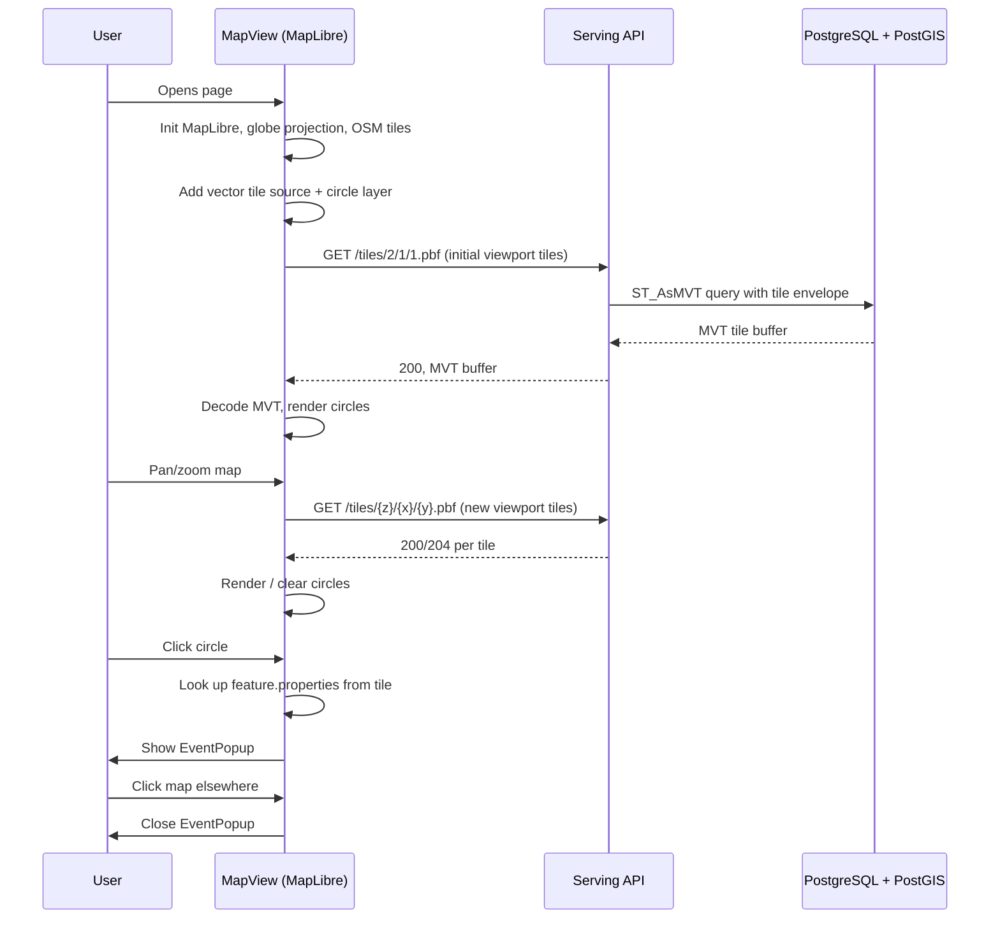

# Frontend — Architecture

## Overview

Vue 3 + Vite + MapLibre GL JS v4+ with globe projection. Single full-screen map displaying event points from MVT tiles served by the Serving API. No event data management in the application — MapLibre handles tile caching and viewport-based loading natively. Pinia holds only UI state (selected feature).

## Technology Stack

| Layer            | Technology                    | Notes                                               |
| ---------------- | ----------------------------- | --------------------------------------------------- |
| Framework        | Vue 3 + Vite + TypeScript     | Lightweight, fast dev server                        |
| Map              | MapLibre GL JS v4+            | MVT tiles, globe projection, OSM raster tiles       |
| State Management | Pinia                         | Selected feature only — no event cache              |
| Styling          | Scoped CSS + `main.css`       | MVP — no design system                              |

## Project Structure

```
frontend/
├── src/
│   ├── App.vue                  # Root, renders MapView full-screen
│   ├── main.ts                  # Create Vue app, mount
│   ├── components/
│   │   ├── MapView.vue          # MapLibre init, tile source, circle layer, popup
│   │   └── EventPopup.vue       # Overlay with event details on marker click
│   ├── stores/
│   │   └── events.ts            # selectedFeature + future filter state
│   ├── services/
│   │   └── api.ts               # Tile URL constant, future: fetch wrapper
│   └── assets/
│       └── styles/
│           └── main.css         # Reset, body full-screen, font
├── index.html
├── package.json
├── tsconfig.json
├── vite.config.ts
├── .gitignore
└── AGENTS.md
```

## Component Tree

```mermaid
flowchart TD
    A[App.vue] --> M[MapView.vue]
    M --> P[EventPopup.vue]
    M --> MS[MapLibre GL JS\nmanaged internally]
    MS --> TS[Vector Tile Source\nGET /tiles/{z}/{x}/{y}.pbf]
    MS --> CL[Circle Layer\nuniform styling]
```

## Module Boundaries & Responsibilities

### `MapView.vue`

The only deep module in the MVP. Hides all MapLibre GL JS complexity behind a self-contained component.

**Interfaces:**
- Props: none
- Emits: none (popup is managed internally)
- Slots: none

**Responsibilities:**
- Initialize MapLibre with globe projection and OSM raster tiles
- Add vector tile source pointing at the Serving API
- Add circle layer (uniform color `#ff6b6b`, radius 6px, opacity 0.8)
- Handle `click` events on the circle layer
- Show/hide `EventPopup` on marker click / map click
- Clean up MapLibre instance on unmount (resize observer, event listeners)

**Hidden complexity:**
- MapLibre instance creation and lifecycle (resize observer, cleanup/destroy)
- Projection configuration and auto-transition from globe to Mercator at zoom ~5
- Tile source URL construction and refresh behavior
- Circle layer paint/click binding
- Cursor style changes on hover (`pointer` over markers)

**MapLibre configuration (MVP):**

```ts
const map = new maplibregl.Map({
  container: 'map',
  style: {
    version: 8,
    sources: {
      'osm-raster': {
        type: 'raster',
        tiles: ['https://tile.openstreetmap.org/{z}/{x}/{y}.png'],
        tileSize: 256,
        attribution: '© OpenStreetMap contributors',
      },
      'events-tiles': {
        type: 'vector',
        tiles: ['http://localhost:3002/tiles/{z}/{x}/{y}.pbf'],
      },
    },
    layers: [
      { id: 'osm-raster', type: 'raster', source: 'osm-raster', minzoom: 0 },
      {
        id: 'events-circle',
        type: 'circle',
        source: 'events-tiles',
        'source-layer': 'events',
        paint: {
          'circle-color': '#ff6b6b',
          'circle-radius': [
            'interpolate', ['exponential', 0.5], ['zoom'],
            0, 2,
            10, 6,
            16, 12,
          ],
          'circle-opacity': 0.8,
          'circle-stroke-color': '#ffffff',
          'circle-stroke-width': 1.5,
        },
      },
    ],
  },
  projection: 'globe',
  zoom: 2,
  center: [0, 20],
});
```

### `EventPopup.vue`

Simple overlay shown when a marker is clicked.

**Interfaces:**
- Props: `feature: { properties: EventProperties }`
- Emits: `@close`

**EventProperties shape (from tile feature):**
```ts
interface EventProperties {
  id: number;
  title: string;
  source: string;
  published_at: string;    // ISO 8601
  location_name: string | null;
  country: string | null;
}
```

**Renders: title, source, date, location name — no image, no description link (MVP).**

### `services/api.ts`

Trivial in MVP — just exports the tile URL base. Future: fetch helpers for non-tile endpoints.

```ts
export const TILE_URL = 'http://localhost:3002/tiles/{z}/{x}/{y}.pbf';
```

### `stores/events.ts`

Holds only UI state — no event data (MapLibre manages tile cache internally).

```ts
interface EventsState {
  selectedFeature: EventProperties | null;
}

// Actions
selectFeature(feature: EventProperties | null): void
clearSelection(): void
```

Future additions: date range filter, source filter, search query.

## Globe → Flat Map Transition

MapLibre GL JS v3+ renders the OSM raster basemap wrapped on a 3D sphere when `projection: 'globe'` is set. At approximately zoom level 5, MapLibre smoothly transitions from globe to Mercator projection. This is a native feature — no custom code required.

Behavior by zoom level:

| Zoom | Projection  | User Experience               |
| ---- | ----------- | ----------------------------- |
| 0–3  | Globe       | Full sphere view, events as dots |
| 3–5  | Globe→Mercator | Smooth transition           |
| 5+   | Mercator    | Flat map, events as dots      |

The circle layer uses `['interpolate', ['exponential', 0.5], ['zoom'], ...]` to scale radius with zoom — tiny dots at global view, larger dots when zoomed in.

## Data Flow



## Key Design Decisions

| Decision              | Choice                              | Rationale                                      |
| --------------------- | ----------------------------------- | ---------------------------------------------- |
| Tile-based rendering  | MVT source, no GeoJSON fetch        | MapLibre handles viewport culling natively     |
| State in MapLibre     | Pinia holds only UI state           | Tile cache is MapLibre's responsibility        |
| Globe projection      | MapLibre native `projection: 'globe'`  | Zero custom code, auto-transitions to flat  |
| OSM raster tiles      | Free, no API key                    | Consistent with existing architecture plan     |
| Uniform circle styling | Single color, no source-based colors | MVP — can add color coding per source later    |
| Circle radius scaling | Exponential zoom interpolation      | Visible at global zoom, sized well when close  |
| No polling            | Page refresh loads fresh tiles      | Tile server always queries live data           |
| No routing            | Single page, no vue-router          | Can add filters/URL params in future           |

## MVP Constraints & Scope

| Dimension | Decision | Rationale |
| --------- | -------- | --------- |
| Views | 1 full-screen map | No sidebar, no list view, no detail panel |
| Events | All events in viewport | No filter or search |
| Interaction | Click → popup | No hover tooltip, no link to source |
| Refresh | Manual page reload | No WebSocket, no polling |
| Map controls | MapLibre defaults | Zoom +/- built-in, no custom controls |
| Responsive | CSS full-screen, fills viewport | No dedicated mobile layout yet |

## Performance

| Metric      | Target     | Notes                                    |
| ----------- | ---------- | ---------------------------------------- |
| Initial load | <3s        | MapLibre + OSM tiles, MVT tile queries   |
| Tile load   | <100ms     | Each tile request, parallel per viewport  |
| Memory      | <100MB     | MapLibre + tile cache in browser memory  |
| FPS         | 60fps      | MapLibre GL compositing, hardware-accelerated |

## Implementation Phases

### Phase 1: MVP (current)

- [ ] Scaffold Vue 3 + Vite + TypeScript project
- [ ] Install MapLibre GL JS v4+ and `@types/maplibre-gl`
- [ ] `MapView.vue` — MapLibre init, globe projection, OSM tiles, tile source, circle layer
- [ ] `EventPopup.vue` — popup on click
- [ ] `events` store — selectedFeature state
- [ ] `api.ts` — tile URL constant
- [ ] Dev server proxy config for `/tiles` → backend
- [ ] Test with data from ingestion pipeline

### Phase 2: Interaction

- [ ] Hover highlight on marker
- [ ] Source-based color coding for circle layer
- [ ] Link to original article in popup
- [ ] Date formatting in popup

### Phase 3: UX

- [ ] Attribution and branding
- [ ] Locate me button
- [ ] Source filter toggle
- [ ] Date range slider
- [ ] Loading skeleton (first tile load)
- [ ] Responsive layout for mobile
