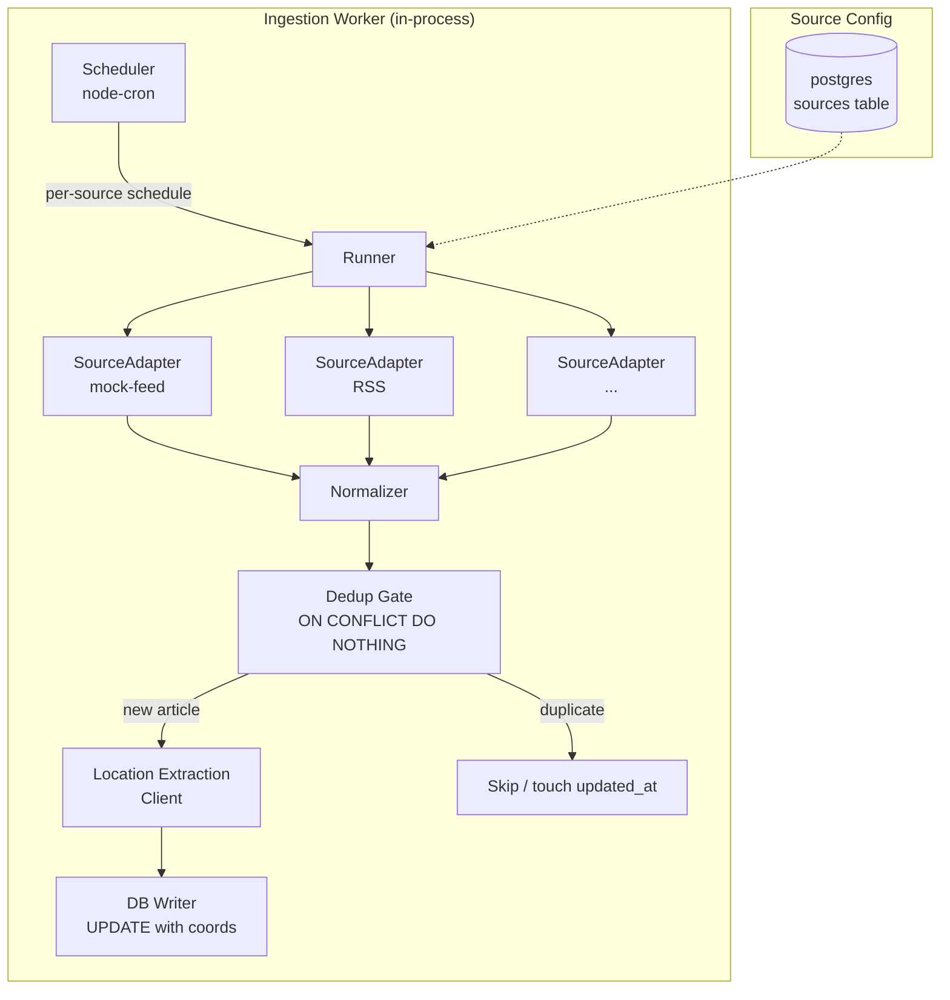
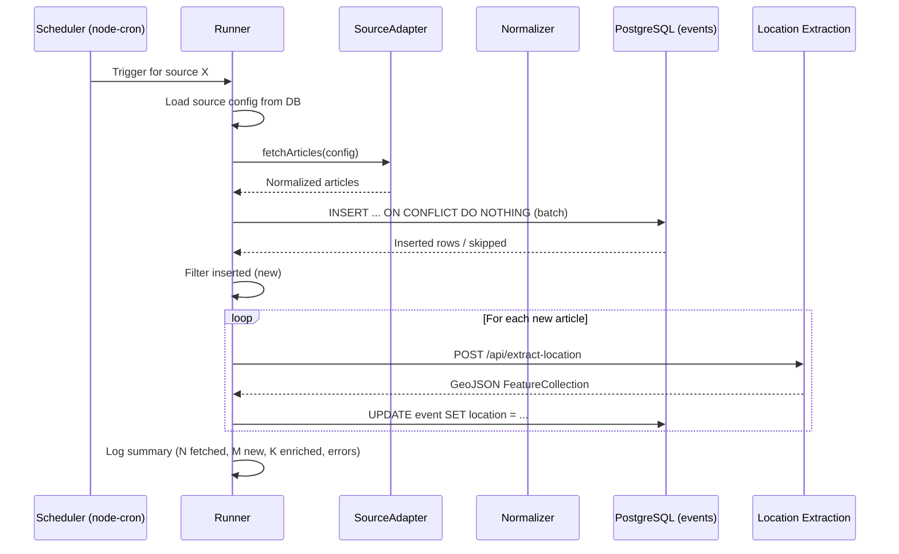

# Ingestion Worker - Architecture

## Overview

Cron-triggered Node.js service that polls external API sources, normalizes articles, deduplicates against PostgreSQL, enriches via Location Extraction service (POST /api/extract-location), and persists enriched events. Pure I/O orchestration — no heavy computation. Part of batch ingestion cycle.

## Goals

- Fetch articles from multiple external sources on per-source schedules
- Normalize articles to standard shape
- Deduplicate via `(source, source_id)` unique constraint + content hash fallback (see ADR-012)
- Enrich new articles via Location Extraction service
- Persist enriched events to PostgreSQL
- Fail gracefully: per-source retry with backoff, skip mode
- Self-healing: no persistent state, next cycle retries failures

## Module Architecture



## File Structure

```
backend/ingestion-worker/
├── src/
│   ├── index.js            # Entry point: init logger, load sources, start scheduler
│   ├── scheduler.js        # node-cron scheduler: register per-source cron jobs
│   ├── runner.js           # Per-source run: fetch → normalize → dedup → enrich → write
│   ├── sources/
│   │   ├── adapter.js      # Abstract adapter interface / base class
│   │   ├── mock-feed.js    # Adapter: fetch mock-feed, return normalized articles
│   │   ├── rss.js          # Adapter: fetch RSS feed, parse XML, return normalized articles
│   │   └── ...             # Future source adapters
│   ├── normalizer.js       # Adapter output → {source_id, title, description, url, published_at}
│   ├── enrich.js           # Location Extraction client: POST /api/extract-location, retry logic
│   ├── db.js               # pg client pool, INSERT/UPDATE queries
│   ├── config.js           # Source config loader: read sources table from PostgreSQL
│   └── logger.js           # Structured JSON logger (pino)
├── tests/
│   ├── unit/
│   │   ├── test-scheduler.js
│   │   ├── test-runner.js
│   │   ├── test-normalizer.js
│   │   ├── test-enrich.js
│   │   └── test-config.js
│   └── integration/
│       ├── test-mock-feed-adapter.js
│       └── test-full-cycle.js
├── package.json
└── AGENTS.md
```

## Source Adapter Contract

Each adapter in `src/sources/*` exports a single async function:

```js
/**
 * @param {object} config - Per-source config row from DB
 * @returns {Promise<Array<{source_id: string, title: string, description: string, url: string, published_at: string}>>}
 */
export async function fetchArticles(config) { ... }
```

- `source_id`: extracted from external ID, or computed SHA-256(title + published_at)
- `title`, `description`: article text (used for location extraction)
- `url`: permalink
- `published_at`: ISO 8601 string

## Per-Source Run Flow



## Scheduling

- **Library**: `node-cron`
- **Mechanism**: Worker runs as daemon. On startup, reads all enabled sources from `sources` table, registers cron jobs per source schedule.
- **Per-source schedule**: Cron expression stored in `sources.schedule` column
- **Reload**: Worker restarts to pick up new source config (MVP); periodic reload can be added later

## Error Handling

| Scenario                  | Behavior                                                                                                                    |
| ------------------------- | --------------------------------------------------------------------------------------------------------------------------- |
| Source fetch fails        | Retry with exponential backoff (3 attempts, 1s/4s/16s). If all fail, log error, skip source, continue others                |
| Location Extraction fails | Retry same article with backoff (3 attempts). If all fail, log article_id, skip enrichment, insert event with null location |
| DB write fails            | Log error, abort current source run (partial write acceptable for MVP)                                                      |
| Worker crash              | No recovery state needed. Next cron triggers re-process all sources (dedup prevents duplicates)                             |

## Technology Stack

| Component   | Technology                                | Rationale                                           |
| ----------- | ----------------------------------------- | --------------------------------------------------- |
| Runtime     | Node.js                                   | Pure I/O orchestration, consistent with serving API |
| HTTP client | `undici` (built-in fetch)                 | No external dep, Node.js native                     |
| Scheduler   | `node-cron`                               | In-process cron, matches batch interval needs       |
| Database    | `pg` (node-postgres)                      | PostgreSQL client, pool management                  |
| Logging     | `pino`                                    | Structured JSON, low overhead, Docker-friendly      |
| XML parsing | `fast-xml-parser`                         | RSS feed parsing (for RSS adapter)                  |
| Testing     | Node built-in `node:test` + `node:assert` | Zero-dependency test runner                         |

## API Endpoints

| Method | Path    | Purpose                                                                    |
| ------ | ------- | -------------------------------------------------------------------------- |
| GET    | /health | Docker health check. Returns `{"status":"ok","sources":3,"lastRun":"..."}` |

Worker exposes health endpoint on internal port (configurable, default 3003).

## Environment Variables

| Variable                  | Default                           | Description                     |
| ------------------------- | --------------------------------- | ------------------------------- |
| `PORT`                    | `3003`                            | Health check server port        |
| `DATABASE_URL`            | —                                 | PostgreSQL connection string    |
| `LOCATION_EXTRACTION_URL` | `http://location-extraction:8000` | Location Extraction service URL |
| `LOG_LEVEL`               | `info`                            | Pino log level                  |

## Performance Targets

| Metric              | Target    | Notes                                                         |
| ------------------- | --------- | ------------------------------------------------------------- |
| Articles per cycle  | Unlimited | Depends on source. Batch INSERT (100/batch)                   |
| Latency per article | <2s       | Dominated by Location Extraction call                         |
| Cycle duration      | <5 min    | Even with many articles, bounded by source fetch + extraction |
| Memory              | <200MB    | No heavy deps, pure I/O                                       |

## Key Design Decisions

| Decision             | Choice                          | Rationale                                    |
| -------------------- | ------------------------------- | -------------------------------------------- |
| In-process scheduler | node-cron                       | No external cron dependency, self-contained  |
| Source config in DB  | sources table                   | Dynamic source registration without restart  |
| Abstract adapter     | async function contract         | Each source: same shape, swap via config row |
| PostgreSQL dedup     | ON CONFLICT DO NOTHING          | Atomic, no race window (ADR-012)             |
| Structured logging   | pino                            | Production-ready, docker log processing      |
| Health endpoint      | GET /health                     | Docker compose healthcheck, orchestration    |
| Retry per source     | Exponential backoff, 3 attempts | Transient failures recover within same cycle |

## Docker

Multi-stage Dockerfile:

```dockerfile
FROM node:22-alpine AS build
WORKDIR /app
COPY package*.json ./
RUN npm ci --only=production

FROM node:22-alpine
WORKDIR /app
COPY --from=build /app/node_modules ./node_modules
COPY src/ ./src/
EXPOSE 3003
CMD ["node", "src/index.js"]
```

## Implementation Phases

### Phase 1: Core Worker (MVP)

- [ ] Project scaffolding (package.json, src/, tests/)
- [ ] `config.js` — read sources from PostgreSQL
- [ ] `sources/adapter.js` — normalizer contract
- [ ] `sources/mock-feed.js` — fetch mock-feed RSS, parse, normalize
- [ ] `db.js` — pg pool, INSERT ON CONFLICT, UPDATE
- [ ] `enrich.js` — Location Extraction client
- [ ] `runner.js` — orchestrate per-source cycle
- [ ] `scheduler.js` — node-cron registration
- [ ] `logger.js` — pino structured logging
- [ ] `index.js` — entry point, health endpoint
- [ ] Dockerfile
- [ ] Unit tests for each module
- [ ] Integration test: full mock-feed cycle

### Phase 2: Production Sources

- [ ] `sources/rss.js` — generic RSS adapter
- [ ] Source config migration (sources table)
- [ ] Add real news feed source

### Phase 3: Hardening

- [ ] Graceful shutdown (SIGTERM handler, drain in-flight)
- [ ] Metrics exposure (prometheus client)
- [ ] Alerting on repeated source failures
