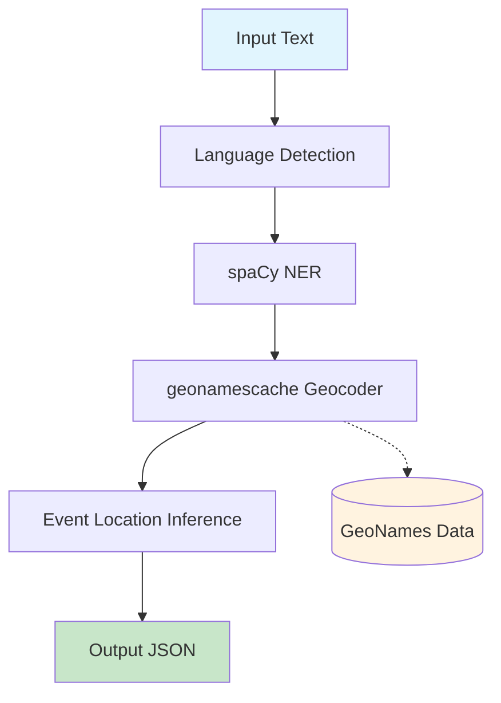
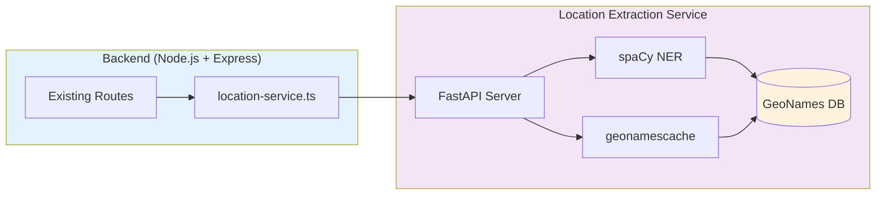

# Location Extraction Service - Architecture

## Overview

A high-throughput, low-latency NLP service that extracts geographic locations from unstructured text (news articles). Designed for processing 1000+ articles/day with sub-second latency, global coverage, and zero API costs.

## Goals

- Extract location mentions from article text
- Disambiguate place names to correct geographic coordinates
- Return structured location data (lat/lon, name, country)
- Process 1000+ articles/day with <1s latency per article
- Global geographic coverage via GeoNames
- Zero external API costs (fully offline)
- Multilingual support (English, French for MVP)
- Deterministic behavior (controlled via seed for reproducible results)

## Pipeline Architecture



### Stage 1: Language Detection

**Technology**: `langdetect`

**Function**: Detect article language to select appropriate NER model

```python
import langdetect
from langdetect import DetectorFactory, LangDetectException

# Seed ensures deterministic results - required for production
DetectorFactory.seed = 0


def detect_language(text: str) -> str:
    if not text or not text.strip():
        return "en"

    try:
        langs = langdetect.detect_langs(text)
        return langs[0].lang if langs else "en"
    except (LangDetectException, Exception):
        return "en"  # Default fallback
```

**Supported Languages (MVP)**:

- `en` - English
- `fr` - French

**Future**: Easy to extend with additional language models.

### Stage 2: Named Entity Recognition (NER)

**Technology**: spaCy with small models

**Function**: Identify location mentions (GPE, LOC entities) in text

**Models (MVP)**:

| Language | Model             | Size  | Accuracy |
| -------- | ----------------- | ----- | -------- |
| English  | `en_core_web_sm`  | ~10MB | Good     |
| French   | `fr_core_news_sm` | ~10MB | Good     |

```python
import spacy
import os
from functools import lru_cache

@lru_cache(maxsize=2)
def get_ner_model(lang: str) -> spacy.Language:
    model_map = {
        "en": os.getenv("SPACY_EN_MODEL", "en_core_web_sm"),
        "fr": os.getenv("SPACY_FR_MODEL", "fr_core_news_sm")
    }
    model_name = model_map.get(lang, "en_core_web_sm")
    return spacy.load(model_name)

def extract_location_mentions(text: str, lang: str) -> list[dict]:
    nlp = get_ner_model(lang)
    doc = nlp(text)
    locations = []
    for ent in doc.ents:
        if ent.label_ in ("GPE", "LOC"):
            locations.append({
                "text": ent.text,
                "label": ent.label_,
                "start": ent.start_char,
                "end": ent.end_char
            })
    return locations
```

**Entity Types**:

- `GPE`: Geopolitical entities (countries, cities, states)
- `LOC`: Non-GPE locations (mountains, seas, regions)

### Stage 3: Toponym Resolution (Geocoding)

**Technology**: `geonamescache`

**Function**: Convert place names to coordinates using GeoNames data

**Features**:

- Offline operation (no API calls) — data ships with the pip package
- 200,000+ cities worldwide (configurable population threshold)
- Case-insensitive exact matching on name + all alternate names
- Highest-population disambiguation on name collisions

```python
from collections import defaultdict
from dataclasses import dataclass, field

import geonamescache

from src.models import EntityMention, GeocodedLocation


_NAME_INDEX: dict[str, list[dict]] | None = None


def _build_index() -> dict[str, list[dict]]:
    gc = geonamescache.GeonamesCache(min_city_population=500)
    cities = gc.get_cities()
    index: dict[str, list[dict]] = defaultdict(list)
    for city in cities.values():
        name: str = city["name"]
        if name:
            index[name.lower()].append(city)
        alternates: list[str] = city.get("alternatenames") or []
        for alt in alternates:
            if alt:
                index[alt.lower()].append(city)
    return dict(index)


def _get_index() -> dict[str, list[dict]]:
    global _NAME_INDEX
    if _NAME_INDEX is None:
        _NAME_INDEX = _build_index()
    return _NAME_INDEX


def _geocode(text: str) -> GeocodedLocation | None:
    index = _get_index()
    candidates = index.get(text.lower())
    if not candidates:
        return None
    best = max(candidates, key=lambda c: c.get("population") or 0)
    return GeocodedLocation(
        lat=best["latitude"],
        lon=best["longitude"],
        text=text,
        country=best["countrycode"],
    )


@dataclass
class GeoResult:
    locations: list[GeocodedLocation] = field(default_factory=list)


class GeoPipeline:
    """Geocodes NER entity mentions via geonamescache with injectable geocode fn."""

    def __init__(self, geocode_fn=None):
        self._geocode_fn = geocode_fn or _geocode

    def run(self, entities: list[EntityMention]) -> GeoResult:
        locations = []
        for entity in entities:
            result = self._geocode_fn(entity.text)
            if result is not None:
                locations.append(
                    GeocodedLocation(
                        text=entity.text,
                        lat=result.lat,
                        lon=result.lon,
                        country=result.country,
                        type=entity.label,
                    )
                )
        return GeoResult(locations=locations)
```

### Stage 4: Event Location Inference

**Function**: Identify the primary event location from multiple extracted locations

**Approach**: Weighted scoring based on:

1. **Position** - Earlier mentions are more likely primary location
2. **Type** - GPE entities score higher than LOC
3. **Context** - Prepositions ("in", "at", "near") indicate event location

```python
def infer_event_location(locations: list[dict], text: str) -> dict | None:
    if not locations:
        return None

    scored_locations = []
    for i, loc in enumerate(locations):
        position_score = 1.0 / (i + 1)  # Earlier = higher score
        type_score = 1.5 if loc.get("label") == "GPE" else 1.0

        scored_locations.append({
            **loc,
            "final_score": position_score * type_score
        })

    best = max(scored_locations, key=lambda x: x["final_score"])
    return {
        "text": best["text"],
        "lat": best.get("lat"),
        "lon": best.get("lon"),
        "country": best.get("country"),
        "confidence": min(best["final_score"] * 0.5, 1.0)
    }
```

## Output Format

### Internal: `LocationResult` Dataclass

`LocationPipeline.run(text)` returns a `LocationResult` dataclass:

| Field                | Type                    | Description                              |
| -------------------- | ----------------------- | ---------------------------------------- |
| `detected_language`  | `str`                   | Detected language code (e.g. 'en', 'fr') |
| `model_name`         | `str \| None`           | spaCy model used for NER                 |
| `event_location`     | `EventLocation \| None` | Best-guess event location or null        |
| `all_locations`      | `list[ScoredLocation]`  | All scored locations with scores         |
| `entities_found`     | `int`                   | Number of NER entities extracted         |
| `entities_geocoded`  | `int`                   | Number successfully geocoded             |
| `processing_time_ms` | `float`                 | Total pipeline time in milliseconds      |

### API: GeoJSON FeatureCollection

The FastAPI server serializes the `LocationResult` into a GeoJSON FeatureCollection with a `geocoding` metadata block:

| Field         | Type             | Description                                                    |
| ------------- | ---------------- | -------------------------------------------------------------- |
| `type`        | `str`            | `"FeatureCollection"`                                          |
| `features`    | `list[GeoFeature]` | Array containing the primary event location as a GeoJSON Feature |
| `geocoding`   | `GeocodingMetadata` | Metadata block with query info, counts, and all scored locations |

Each `GeoFeature` (primary location):

| Field        | Type                      | Description                            |
| ------------ | ------------------------- | -------------------------------------- |
| `type`       | `str`                     | `"Feature"`                            |
| `geometry`   | `dict`                    | `{"type": "Point", "coordinates": [lon, lat]}` |
| `properties` | `GeoFeatureProperties`    | `name`, `country`, `country_name`, `confidence` |

The `GeocodingMetadata` block replicates pipeline diagnostics and includes `all_locations` as `ScoredFeature` objects (same GeoJSON Feature shape with `type`, `score` properties).

### Typed Intermediate Records

All pipeline stages exchange typed dataclasses rather than raw dicts:

| Record             | Fields                                                            |
| ------------------ | ----------------------------------------------------------------- |
| `EntityMention`    | `text`, `label`, `start`, `end`                                   |
| `GeocodedLocation` | `text`, `lat`, `lon`, `country`, `type?`                          |
| `ScoredLocation`   | `text`, `lat`, `lon`, `country`, `country_name`, `type?`, `score` |
| `EventLocation`    | `text`, `lat`, `lon`, `country`, `country_name`, `confidence`     |

```json
{
  "type": "FeatureCollection",
  "features": [
    {
      "type": "Feature",
      "geometry": { "type": "Point", "coordinates": [2.3522, 48.8566] },
      "properties": {
        "name": "Paris",
        "country": "FR",
        "country_name": "France",
        "confidence": 0.85
      }
    }
  ],
  "geocoding": {
    "query": { "text": "Article text content here..." },
    "detected_language": "fr",
    "model_name": "fr_core_news_sm",
    "entities_found": 2,
    "entities_geocoded": 2,
    "processing_time_ms": 150.0,
    "all_locations": [
      {
        "type": "Feature",
        "geometry": { "type": "Point", "coordinates": [2.3522, 48.8566] },
        "properties": {
          "name": "Paris",
          "country": "FR",
          "country_name": "France",
          "type": "GPE",
          "score": 2.17
        }
      }
    ]
  }
}
```

## Service Architecture



### API Endpoint

```
POST /api/extract-location
Content-Type: application/json

{
  "text": "Article text content here...",
  "language": "auto"
}

Response: GeoJSON FeatureCollection with geocoding metadata (see Output Format)
```

```
GET /health

Response: {"status": "ok"}
```

### Performance Targets

| Metric        | Target         | Notes                               |
| ------------- | -------------- | ----------------------------------- |
| Throughput    | 1000+ docs/day | ~12 docs/minute sustained           |
| Latency (p95) | <1 second      | Per document                        |
| Memory        | ~2GB           | spaCy models + geocoder             |
| Accuracy      | >85%           | Correct location for clear mentions |

## Evaluation Module

Evaluation framework for measuring pipeline quality. Covers both NER (Stages 1-2) and geocoding + event location (Stages 3-4).

### Stages 1-2: NER Evaluation (Precision/Recall/F1)

Defined in [ADR-002](../decisions/ADR-002-ner-evaluation-protocol.md).

**Approach**: Entity-level exact match — a prediction is correct only when `text`, `start`, `end`, and `label` all match the expected annotation exactly. No partial credit.

**Metrics** computed overall and per entity type (GPE, LOC):

| Metric    | Meaning                               |
| --------- | ------------------------------------- |
| Precision | TP / (TP + FP)                        |
| Recall    | TP / (TP + FN)                        |
| Entity F1 | Harmonic mean of precision and recall |

The pipeline runner was split in [ADR-006](../decisions/ADR-006-pipeline-architectural-improvements.md): `run_pipeline_on_corpus()` handles orchestration, `evaluate_corpus()` is a thin composition.

### Stages 3-4: Geocoding and Event Location Evaluation

**Geocoding Metrics**:

| Metric           | Meaning                                              |
| ---------------- | ---------------------------------------------------- |
| Geocoding Rate   | Fraction of expected locations successfully geocoded |
| Country Accuracy | Among geocoded, fraction with correct country code   |

**Event Location Metrics**:

| Metric   | Meaning                                                         |
| -------- | --------------------------------------------------------------- |
| Accuracy | Fraction of expected event locations where text + country match |

Corpus samples can include optional `expected_geocoded_locations` and `expected_event_location` fields. When present, `evaluate_geocoding_corpus()` and `evaluate_geocoding_all_corpora()` compute geocoding metrics.

### Usage

```bash
cd backend/location-extraction-service
# NER evaluation (single corpus)
uv run python -m src.evaluation tests/corpus/en_simple.json
# NER evaluation (all corpora)
uv run python -m src.evaluation
# Stages 3-4 evaluation (single corpus)
uv run python -m src.evaluation --geocoding tests/corpus/en_simple.json

# Geocoding evaluation (all corpora)
uv run python -m src.evaluation --geocoding
```

### Corpus

Six JSON files in `tests/corpus/` (simple, paragraphs, edge cases × EN, FR), totaling 200+ entities per language. Corpus samples optionally include `expected_geocoded_locations` (list of `{text, country}`) and `expected_event_location` (`{text, country}`) for geocoding evaluation.

## Technology Stack

| Component          | Technology         | Version | Rationale                                                |
| ------------------ | ------------------ | ------- | -------------------------------------------------------- |
| NER                | spaCy              | 3.x     | Industry standard                                        |
| NER Models         | en/fr_core_news_sm | latest  | Small models (~10MB), good accuracy for MVP              |
| Language Detection | langdetect         | latest  | Lightweight, no training needed (seed=0 for determinism) |
| Geocoder           | geonamescache      | 3.0.1   | Offline, GeoNames data bundled with pip package          |
| Runtime            | Python 3.14        | latest  | Latest Python with best performance                      |
| API Server         | FastAPI            | latest  | Fast, async, auto-docs                                   |
| Container          | Docker             | -       | Isolated, reproducible                                   |

## File Structure

```
backend/
├── src/
│   ├── routes/
│   │   └── location-extraction.ts   # API endpoint
│   ├── services/
│   │   └── location-service.ts      # HTTP client for Python service
│   └── ...
├── location-extraction-service/     # Python microservice
│   ├── src/
│   │   ├── app.py                   # FastAPI server, /health, /api/extract-location, dependency injection
│   │   ├── schemas.py               # Pydantic schemas (GeoJSON FeatureCollection, GeoFeature, etc.)
│   │   ├── models.py                # Typed dataclasses: EntityMention, GeocodedLocation, LocationResult, etc.
│   │   ├── pipeline.py              # NerPipeline + NerResult + internal detection/NER/model
│   │   ├── geocoding.py             # GeoPipeline + GeoResult + internal geonamescache wrapper (injectable)
│   │   ├── disambiguator.py         # DisambiguatePipeline + event location inference (Stage 4)
│   │   ├── orchestrator.py          # LocationPipeline: composes all 4 stages into single .run()
│   │   ├── evaluation/              # Pipeline quality evaluation
│   │   │   ├── __init__.py          # Pure evaluation computation (NER, geocoding, event location)
│   │   │   ├── runner.py            # Pipeline orchestration + corpus loading + multi-corpus aggregation
│   │   │   └── __main__.py          # CLI entry point (supports --geocoding flag)
│   ├── tests/
│   │   ├── conftest.py
│   │   ├── unit/
│   │   │   ├── test_detector.py
│   │   │   ├── test_extractor.py
│   │   │   ├── test_disambiguator.py
│   │   │   ├── test_geocoding.py
│   │   │   └── test_evaluation.py
│   │   ├── integration/
│   │   │   ├── conftest.py
│   │   │   ├── test_api.py              # FastAPI integration tests (mock pipeline)
│   │   │   ├── test_nlp_manager.py
│   │   │   └── test_pipeline_integration.py
│   │   └── corpus/                   # Evaluation test corpora
│   │       ├── en_simple.json
│   │       ├── en_paragraphs.json
│   │       ├── en_edge_cases.json
│   │       ├── fr_simple.json
│   │       ├── fr_paragraphs.json
│   │       └── fr_edge_cases.json
│   ├── Dockerfile
│   ├── pyproject.toml
│   └── README.md
└── ...
```

## Dockerfile

```dockerfile
FROM python:3.14-slim

WORKDIR /app

ENV PYTHONUNBUFFERED=1 \
    PIP_NO_CACHE_DIR=1 \
    UV_COMPILE_BYTECODE=1 \
    SPACY_EN_MODEL=en_core_web_sm \
    SPACY_FR_MODEL=fr_core_news_sm

RUN pip install --no-cache-dir uv

COPY pyproject.toml .
RUN uv sync --frozen --no-dev

# Download spaCy models (using env variables for flexibility)
RUN --mount=type=cache,target=/root/.cache \
    uv run python -m spacy download ${SPACY_EN_MODEL} && \
    uv run python -m spacy download ${SPACY_FR_MODEL}


COPY src/ ./src/

EXPOSE 8000

CMD ["uv", "run", "uvicorn", "src.app:app", "--host", "0.0.0.0", "--port", "8000"]
```

### Environment Variables

| Variable         | Default           | Description               |
| ---------------- | ----------------- | ------------------------- |
| `SPACY_EN_MODEL` | `en_core_web_sm`  | English spaCy small model |
| `SPACY_FR_MODEL` | `fr_core_news_sm` | French spaCy small model  |

These default to small models (~10MB) for fast processing. Override at runtime if needed.

## Implementation Phases

### Phase 1: Core Pipeline (MVP)

- [x] spaCy NER integration (EN + FR)
- [x] Language detection
- [x] geonamescache offline geocoding
- [x] Basic event location inference
- [x] Docker containerization
- [x] FastAPI server with GeoJSON FeatureCollection response
- [x] HTTP API endpoint (POST /api/extract-location, GET /health)
- [x] Pydantic request/response schemas
- [x] Unit tests
- [x] Integration tests (mocked pipeline)

### Phase 1b: Evaluation Framework

- [x] Entity-level exact match evaluation protocol (ADR-002)
- [x] Evaluation corpus (EN + FR, 200+ entities per language)
- [x] CLI runner for standalone evaluation
- [x] Wired into NER pipeline for regression detection

### Phase 2: Accuracy Improvements

- [ ] Measure baseline accuracy on evaluation corpus
- [ ] Fine-tune disambiguation heuristics
- [ ] Add handling for edge cases (ambiguous names)
- [ ] Performance optimization

### Phase 3: Production Hardening

- [ ] Caching layer for frequent queries
- [ ] Batch processing optimization
- [ ] Monitoring and metrics
- [ ] Load testing

## Future Considerations

### Language Expansion

| Phase   | Languages  | Notes                      |
| ------- | ---------- | -------------------------- |
| MVP     | EN, FR     | Current scope              |
| Phase 2 | DE, ES, PT | European expansion         |
| Phase 3 | ZH, JA, KO | Asian languages            |
| Future  | AR, RU, HI | Additional global coverage |

### Upgrade Path: Mordecai3

If accuracy is insufficient, upgrade path to Mordecai3:

- Replace geonamescache with Mordecai3.Geoparser()
- Add Elasticsearch container (~4GB RAM)
- Neural disambiguation model (auto-downloads)
- Expected accuracy improvement: 85% → 95%

## References

- [spaCy](https://spacy.io/)
- [spaCy Models](https://spacy.io/models)
- [text2geo](https://github.com/charonviz/text2geo) (replaced by `geonamescache` per ADR-007)
- [geonamescache](https://pypi.org/project/geonamescache/)
- [whereabouts](https://github.com/ajl2718/whereabouts)
- [GeoNames](https://www.geonames.org/)
- [Mordecai3](https://github.com/ahalterman/mordecai3)
- [FastAPI](https://fastapi.tiangolo.com/)
- [ADR-003: NER Pipeline Seam](../decisions/ADR-003-ner-pipeline-seam.md)
