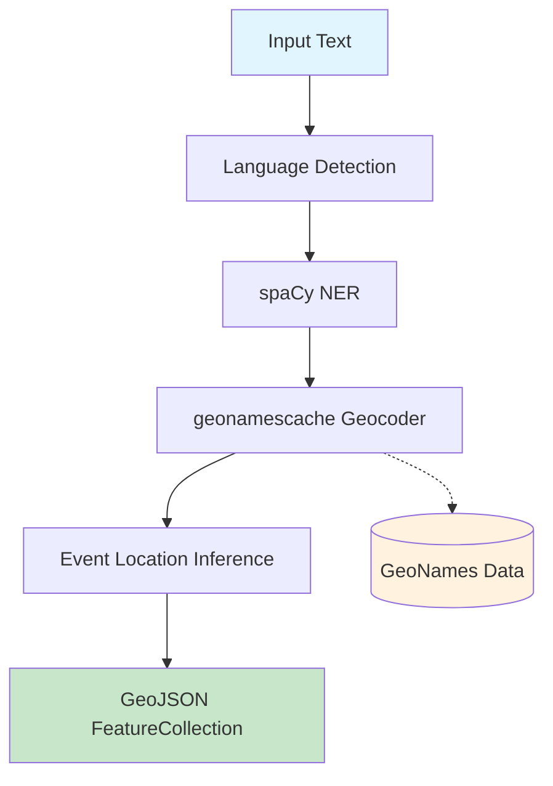
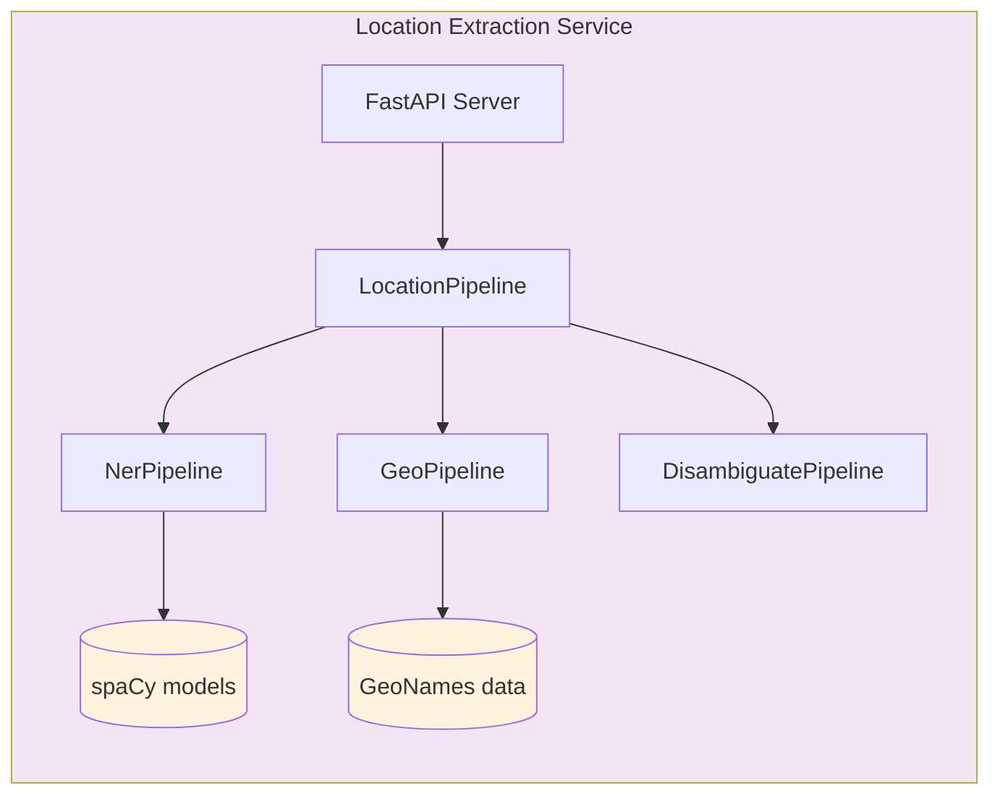

# Location Extraction Service - Architecture

## Overview

A high-throughput, low-latency NLP service that extracts geographic locations from unstructured text (news articles). Designed for processing 1000+ articles/day with sub-second latency, global coverage, and zero API costs.

## Goals

Extract location mentions from text, disambiguate to correct coordinates, and return structured GeoJSON with a primary event location and all scored entities. Fully offline, multilingual (EN/FR MVP), deterministic, with injectable sub-pipelines for testability.

## Pipeline Architecture

## Module Boundaries & Responsibilities

| Module                              | Input                              | Output                                                    | Complexity Hidden                                                                                                                                     |
| ----------------------------------- | ---------------------------------- | --------------------------------------------------------- | ----------------------------------------------------------------------------------------------------------------------------------------------------- |
| **NerPipeline** (stages 1-2)        | Raw text                           | `NerResult` (language, entity mentions with char offsets) | Language detection, spaCy model selection/caching (seed=0 for determinism), NER extraction, fallback to English on failure                            |
| **GeoPipeline** (stage 3)           | List of `EntityMention`            | `GeoResult` (geocoded locations, failures)                | Offline GeoNames index building, case-insensitive name + alternate-name matching, population-based disambiguation, injectable `geocode_fn` test seam  |
| **DisambiguatePipeline** (stage 4)  | Geocoded locations + original text | `DisambiguateResult` (best event location, all scored)    | Position scoring (earlier = higher), entity type weighting (GPE 2.5× vs LOC 1.0×), preposition-context boost ("in/at/near"), confidence normalization |
| **LocationPipeline** (orchestrator) | Raw text                           | `LocationResult` (merged result with timing diagnostics)  | Stage sequencing, merging geocoding results back to NER entities, performance timing; all sub-pipelines injectable for testing                        |

## API Contract

`POST /api/extract-location` accepts `{"text": "...", "language": "auto"}` and returns a **GeoJSON FeatureCollection** where:

- `features` — array containing the primary event location as a GeoJSON Point Feature (name, country, confidence)
- `geocoding` — metadata block with query info, language, model name, entity counts, timing, and all entities (each with optional nested geocoding data if successfully resolved, `null` geometry otherwise)

`GET /health` returns `{"status": "ok"}`.

## Service Architecture

## Technology Stack

| Component          | Technology                 | Rationale                                          |
| ------------------ | -------------------------- | -------------------------------------------------- |
| API Server         | FastAPI (Python 3.14)      | Fast, async, auto-docs                             |
| Language Detection | langdetect                 | Lightweight, seed=0 for determinism                |
| NER                | spaCy + en/fr_core_news_sm | Industry standard, ~10MB models, good MVP accuracy |
| Geocoder           | geonamescache (3.0.1)      | Offline, GeoNames data bundled with pip package    |
| Country lookup     | pycountry                  | ISO code → country name resolution                 |
| Container          | Docker                     | Isolated, reproducible                             |

## Key Design Decisions

| Decision       | Choice                           | Rationale                                                                                               |
| -------------- | -------------------------------- | ------------------------------------------------------------------------------------------------------- |
| Geocoding      | geonamescache (offline)          | Zero API costs, fully offline, 200K+ cities with alternate name matching (per ADR-007)                  |
| Architecture   | Injectable sub-pipelines         | Each pipeline stage accepts optional constructor injection for isolated unit testing                    |
| Interface      | Typed dataclasses between stages | Not raw dicts — each pipeline stage has explicit input/output records (per ADR-006)                     |
| Disambiguation | Weighted scoring (not ML)        | Simple heuristics — position, type, preposition context — sufficient for MVP, no training data required |
| NER Models     | Small spaCy models (~10MB)       | Fast loading, low memory; trivially swapped for larger models if accuracy requires                      |

## Performance Targets

| Metric        | Target         | Notes                               |
| ------------- | -------------- | ----------------------------------- |
| Throughput    | 1000+ docs/day | ~12 docs/minute sustained           |
| Latency (p95) | <1 second      | Per document                        |
| Memory        | ~2GB           | spaCy models + geocoder index       |
| Accuracy      | >85%           | Correct location for clear mentions |

## Constraints & Assumptions

- Limited to EN and FR languages for MVP; adding languages requires a spaCy model and a `_MODEL_MAP` entry
- Population-based geocoding disambiguation assumes the most populous match is correct, which may fail for low-population places sharing names with famous cities
- Language detection defaults to English on failure or empty input
- spaCy small models trade NER accuracy for startup speed and memory; upgrade path to larger models exists

## Evaluation Module

Quality evaluation covers NER (stages 1-2) and geocoding + event location (stages 3-4). See the [Evaluation Guide](../evaluation.md).

## References

- [ADR-003: NER Pipeline Seam](../decisions/ADR-003-ner-pipeline-seam.md)
- [ADR-006: Pipeline Architectural Improvements](../decisions/ADR-006-pipeline-architectural-improvements.md)
- [ADR-007: Replace text2geo with geonamescache](../decisions/ADR-007-replace-text2geo-with-geonamescache.md)
- [spaCy](https://spacy.io/), [geonamescache](https://pypi.org/project/geonamescache/), [GeoNames](https://www.geonames.org/)
