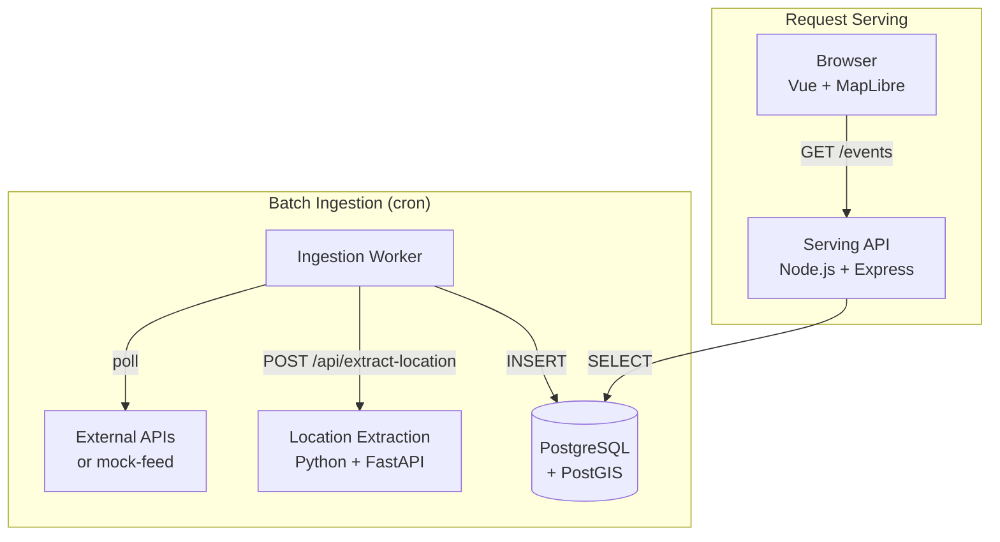
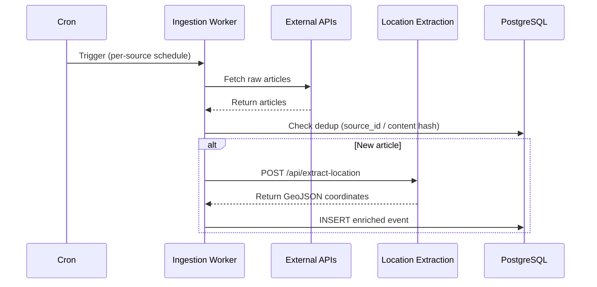
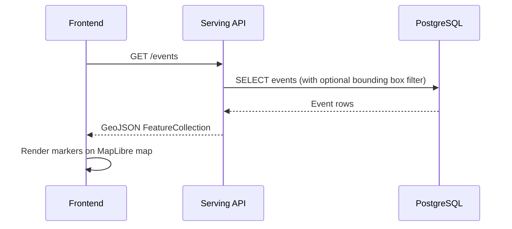

# Living Map - Architecture Overview

## Overview

A real-time web application displaying geographical events on an interactive map. Designed for mobile-first viewing with public, read-only access.

## Technology Stack

| Layer               | Technology           | Notes                                             |
| ------------------- | -------------------- | ------------------------------------------------- |
| Frontend            | Vue 3 + Vite         | Lightweight, mobile-optimized                     |
| Map                 | MapLibre GL JS       | Open-source, OSM tiles                            |
| State Management    | Pinia                | Official Vue recommendation                       |
| Serving API         | Node.js + Express    | Read-only API, reads from PostgreSQL              |
| Ingestion Worker    | Node.js              | Cron-triggered batch ingestion from external APIs |
| Location Extraction | Python + FastAPI     | NLP service for extracting coordinates from text  |
| Database            | PostgreSQL + PostGIS | Geospatial persistence, spatial indexes           |
| External Data       | External APIs        | Real news/event feeds (mock-feed for testing)     |

## High-Level Architecture



**Note**: `mock-feed` (port 3001) provides test data. Location Extraction is detailed in [location-extraction.md](./location-extraction.md). PostgreSQL runs as a separate container with PostGIS extension for geospatial queries.

## Frontend Architecture (planned)

```
frontend/
├── src/
│   ├── components/      # Reusable UI components
│   ├── views/           # Page-level components
│   ├── stores/          # Pinia stores
│   ├── composables/     # Vue composables (hooks)
│   ├── services/        # API client
│   └── assets/          # Styles, images
```

## Backend Architecture

```
backend/
├── api/                          # Serving API (Express)
│   ├── src/
│   │   ├── routes/               # GET /events, etc.
│   │   ├── services/             # External integrations
│   │   ├── db/                   # PostgreSQL client + queries
│   │   └── utils/                # Helpers
│   └── package.json
├── ingestion-worker/             # Node.js batch ingestion service
│   ├── src/
│   │   ├── index.js              # Entry point, cron scheduler
│   │   ├── sources/              # Source adapters (mock-feed, RSS, …)
│   │   ├── dedup.js              # source_id + content hash dedup
│   │   └── config.js             # Per-source schedule config
│   └── package.json
├── mock-feed/                    # Mock external RSS feed (for testing)
│   ├── src/
│   │   ├── routes/               # /feed endpoint
│   │   └── utils/                # Generator, RSS builder
│   ├── README.md
│   └── AGENTS.md
├── location-extraction-service/  # Python NLP microservice
│   ├── src/                      # FastAPI application
│   ├── Dockerfile
│   ├── pyproject.toml
│   └── README.md
├── migrations/                   # DB schema migrations (node-pg-migrate)
├── docker-compose.yml            # Services: api, ingestion-worker, postgres,
│                                 #   location-extraction, mock-feed
└── .env                          # Configuration
```

## Data Flow

The system has two independent cycles:

### Ingestion Cycle (batch, cron-triggered)



1. Cron triggers Ingestion Worker per source schedule (configurable)
2. Worker fetches raw articles from external API (or mock-feed)
3. Worker checks dedup: primary key `source_id`, fallback content hash
4. For new articles, Worker POSTs to Location Extraction service
5. Worker INSERTs enriched event (text + coordinates) into PostgreSQL

### Serving Cycle (request-response)



1. Frontend requests events via GET /events (with optional bounding box)
2. Serving API queries PostgreSQL for matching events
3. API returns GeoJSON FeatureCollection to frontend
4. Frontend renders markers on MapLibre map

## Key Design Decisions

| Decision            | Choice                     | Rationale                                                |
| ------------------- | -------------------------- | -------------------------------------------------------- |
| Map Library         | MapLibre GL JS             | Open-source, no API key, OSM tiles                       |
| Data Freshness      | Batch ingestion (cron)     | Sufficient for news-cycle data, simpler than queue       |
| Persistence         | PostgreSQL + PostGIS       | Geospatial queries, concurrent writes, survives restarts |
| Ingestion Worker    | Node.js                    | Pure I/O orchestration, consistent with serving API      |
| Services            | Separate (ingestion + API) | Independent scaling, failure isolation                   |
| Deduplication       | source_id + content hash   | Handles both stable and unstable source IDs              |
| Responsive          | Mobile-first CSS           | Essential for mobile-friendly requirement                |
| Location Extraction | spaCy + geonamescache      | Offline NLP, zero API costs, global coverage             |

## Constraints & Assumptions

- Public, read-only access (no authentication)
- Small scale (< 1000 concurrent users)
- External API sources: mock-feed (RSS) for testing, real feeds to be added later
- Data freshness: batch ingestion runs at configurable per-source intervals
- PostgreSQL + PostGIS: geospatial persistence, spatial indexes for bounding box queries
- Ingestion failure does not affect serving (stale data served until next successful cycle)
