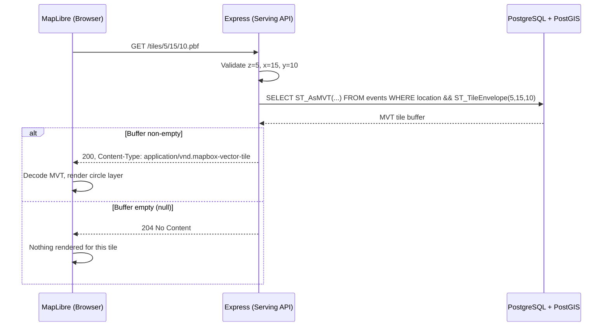

# Serving API — Architecture

## Overview

Read-only Express server that generates Mapbox Vector Tiles (MVT) from PostGIS. Single endpoint `GET /tiles/{z}/{x}/{y}.pbf` — the frontend loads tiles directly as a MapLibre vector tile source. No GeoJSON REST endpoints, no pagination, no caching layer.

## Module Architecture

```mermaid
flowchart LR
    subgraph Express["Serving API (Express)"]
        R[routes/tiles.ts] -->|validate z/x/y| S[services/tiles.ts]
        S -->|ST_AsMVT query| DB[db/client.ts]
    end

    subgraph Storage["Persistence"]
        PG[(PostgreSQL\n+ PostGIS)]
    end

    F[Browser\nMapLibre GL JS] -->|GET /tiles/{z}/{x}/{y}.pbf| R
    DB -->|pg Pool| PG
```

## File Structure

```
backend/api/
├── src/
│   ├── index.ts            # Express app setup, CORS, listen
│   ├── routes/
│   │   └── tiles.ts        # GET /tiles/:z/:x/:y.pbf
│   ├── services/
│   │   └── tiles.ts        # getTile(z, x, y) → ST_AsMVT SQL
│   └── db/
│       └── client.ts       # pg Pool singleton
├── tests/
│   ├── unit/
│   │   ├── tiles.test.ts
│   │   └── db.test.ts
│   └── integration/
│       └── tiles.test.ts   # Testcontainers + PostGIS
├── package.json
├── tsconfig.json
├── Dockerfile
├── biome.json
├── README.md
└── AGENTS.md
```

## Module Boundaries & Responsibilities

### `routes/tiles.ts`

Accepts URL path, validates tile coordinates, delegates to service, returns Buffer.

```ts
// Registered route
GET /tiles/:z/:x/:y.pbf

// Validation
- z: integer, 0–22
- x: integer, 0–2^z
- y: integer, 0–2^z

// Response
- 200 → application/vnd.mapbox-vector-tile (Buffer)
- 204 → No Content (no events in tile bounds)
- 400 → Bad Request (invalid coords, non-integer, out of range)
```

### `services/tiles.ts`

Generates MVT via single PostGIS query. Hides tile envelope math, geometry encoding, and property selection.

```ts
async function getTile(z: number, x: number, y: number): Promise<Buffer | null>;
```

Core SQL:

```sql
SELECT ST_AsMVT(tile, 'events', 4096, 'mvtgeom')
FROM (
  SELECT
    ST_AsMVTGeom(location, ST_TileEnvelope($1, $2, $3), 4096, 256, true) AS mvtgeom,
    id, title, source, published_at, location_name, country
  FROM events
  WHERE location && ST_TileEnvelope($1, $2, $3)
) AS tile
```

- Tile layer name: `events`
- Extent: 4096 (MVT default)
- Buffer: 256 pixels (reduces clipping artifacts at tile edges)
- Properties per feature: `id`, `title`, `source`, `published_at`, `location_name`, `country`
- `location && ST_TileEnvelope(...)` uses the GiST index for fast tile-bounds filtering
- Returns `null` for empty tiles → route sends 204

### `db/client.ts`

Manages the `pg.Pool` instance. Hides connection lifecycle, pool sizing, and graceful shutdown.

```ts
function getPool(): pg.Pool;
async function closePool(): Promise<void>;
```

## Data Flow



## Technology Stack

| Component | Technology                                | Rationale                                           |
| --------- | ----------------------------------------- | --------------------------------------------------- |
| Runtime   | Node.js 22+                               | Consistent with ingestion-worker                    |
| Framework | Express                                   | Lightweight, well-known, sufficient for <1000 users |
| Language  | TypeScript                                | Module contracts at compile time (ADR-015)          |
| Database  | `pg` (node-postgres)                      | Pool management, consistent with ingestion-worker   |
| Tile Gen  | PostGIS `ST_AsMVT` + `ST_TileEnvelope`    | Server-side tile generation, zero extra deps        |
| Testing   | Node built-in `node:test` + `node:assert` | Zero-dependency test runner                         |

## API Endpoints

| Method | Path                | Purpose                                        |
| ------ | ------------------- | ---------------------------------------------- |
| GET    | /tiles/:z/:x/:y.pbf | MVT tile for MapLibre vector tile source       |
| GET    | /health             | Docker health check. Returns `{"status":"ok"}` |

## Environment Variables

| Variable       | Default                 | Description                      |
| -------------- | ----------------------- | -------------------------------- |
| `PORT`         | `3002`                  | Express listen port              |
| `DATABASE_URL` | —                       | PostgreSQL connection string     |
| `CORS_ORIGIN`  | `http://localhost:5173` | Allowed frontend origin for CORS |

## Performance Targets

| Metric              | Target | Notes                                         |
| ------------------- | ------ | --------------------------------------------- |
| Tile latency        | <50ms  | Single indexed query, small result sets       |
| Concurrent users    | <1000  | Stateless, horizontally scalable via replicas |
| Memory per instance | <100MB | No heavy deps, no caching layer               |

## Key Design Decisions

| Decision              | Choice                    | Rationale                                          |
| --------------------- | ------------------------- | -------------------------------------------------- |
| Tile format           | MVT (Mapbox Vector Tile)  | Native MapLibre format, efficient, viewport-culled |
| No GeoJSON endpoint   | Tiles only                | Simpler API surface, MapLibre loads tiles natively |
| Tile generation       | Server-side via PostGIS   | Zero extra services, uses existing PostGIS         |
| No caching (MVP)      | Direct PostGIS queries    | Sufficient for <1000 users, cheap to add later     |
| Express over raw http | Express                   | Route params, CORS middleware, consistent patterns |
| Tile properties       | id + title + source + ... | Enough for popup display, keeps tiles small        |

## Docker

Multi-stage Dockerfile:

```dockerfile
FROM node:22-alpine AS build
WORKDIR /app
COPY package*.json ./
RUN npm ci --only=production

FROM node:22-alpine
WORKDIR /app
COPY --from=build /app/node_modules ./node_modules
COPY src/ ./src/
EXPOSE 3002
CMD ["node", "--experimental-strip-types", "src/index.ts"]
```

## Implementation Phases

### Phase 1: Core Tile Server (MVP)

- [ ] Project scaffolding (package.json, src/, tests/)
- [ ] `db/client.ts` — pg Pool singleton
- [ ] `services/tiles.ts` — ST_AsMVT query with getTile()
- [ ] `routes/tiles.ts` — param validation, response handling
- [ ] `index.ts` — Express app, CORS, health endpoint
- [ ] Dockerfile
- [ ] Unit tests
- [ ] Integration test with Testcontainers + PostGIS
- [ ] Add `api` service to docker-compose.yml

### Phase 2: Production Hardening

- [ ] Tile response caching (ETag / Last-Modified headers)
- [ ] Prometheus metrics (requests, latency, tile size)
- [ ] Graceful shutdown (SIGTERM, drain pool)
- [ ] Rate limiting

### Phase 3: Scale

- [ ] Read replica for tile queries
- [ ] Tile cache (Redis / CDN)
- [ ] Connection pooling tuned per replica count
